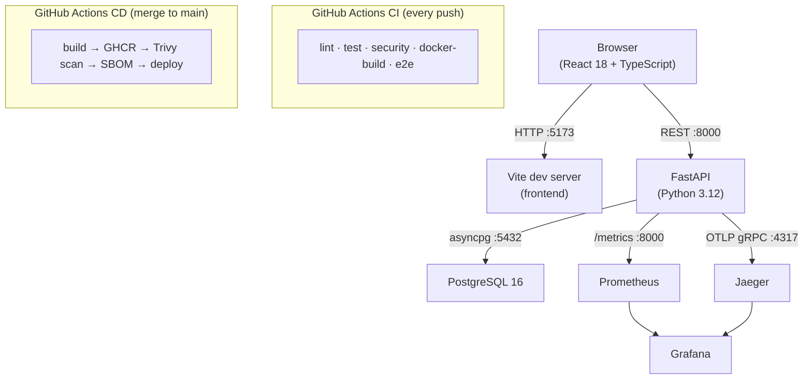

# ADR 0001 — Three-Tier Architecture

**Date:** 2026-06-14
**Status:** Accepted

## Context

We need to build a Task Manager application that demonstrates clean separation of concerns across three tiers: presentation, business logic, and data storage. The lab must also be teachable to students of mixed skill levels using Claude Code as an AI pair programmer throughout the delivery lifecycle.

## Decision

We adopt a **three-tier architecture**:

| Tier | Technology | Responsibility |
|------|-----------|----------------|
| Frontend | React 18 + TypeScript (Vite) | User interface and UX |
| Business Logic | FastAPI (Python 3.12) | API, validation, business rules, auth |
| Data | PostgreSQL 16 | Persistent storage |

Services run locally via **Docker Compose** (CI default) or **.NET Aspire** (preferred for local dev — adds a Developer Dashboard with traces, logs, and health checks at https://localhost:15888). GitHub Actions enforces lint, type-check, test coverage, SAST (bandit), dependency audit, Trivy image scan, and SBOM generation on every push.

## Rationale

- **React + FastAPI + PostgreSQL** is a widely-used, well-documented stack with strong Claude Code understanding, making AI-assisted suggestions more accurate.
- **Separation of tiers in distinct services** (not a monolith) teaches students about service boundaries and network communication.
- **Business logic in the API layer** (not stored procedures) keeps the rules testable in Python without a database.
- **Docker Compose** gives every student a consistent environment regardless of OS.

## Diagram

See [`docs/diagrams.md`](../diagrams.md) for the full architecture diagram, use case diagram, sequence diagrams, class diagram, and ER diagram.

## Consequences

- Students must understand both Python and TypeScript — the lab scaffolds this with starter code and a reference solution.
- Cloud deployment is core curriculum (Module 13), not an extension exercise — students choose one of: Fly.io, AWS ECS Fargate, GCP Cloud Run, or Azure Container Apps. All paths are provided; each is gated by `if: false` in `publish.yml` until the student configures it.
- The clear boundary between tiers makes it easy to swap one tier (e.g., change frontend framework) as an advanced exercise.
- The observability stack (Jaeger, Prometheus, Grafana, Blackbox Exporter) runs as an optional Docker Compose profile — students activate it in Module 05b and continue using it through Modules 11–15 (load testing, pen testing, SLOs, and error budgets).
- The CI pipeline is gated by a 12-domain compliance check (code quality, test coverage, SAST, CVEs, security runtime, architecture, database, governance, observability, documentation, container security, CI/CD) surfaced via the `/compliance-check` skill — see `.claude/commands/compliance-check.md`.
- Load-testing SLOs (p95 < 500 ms at 50 VUs for local Docker; per-endpoint thresholds in `load-tests/k6/load.js`) are enforced by a k6 smoke gate run after each staging deploy in the promotion pipeline (see ADR 0005).
