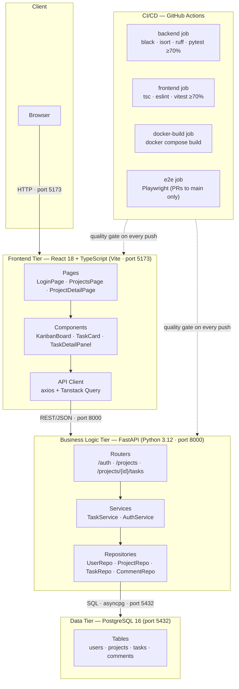
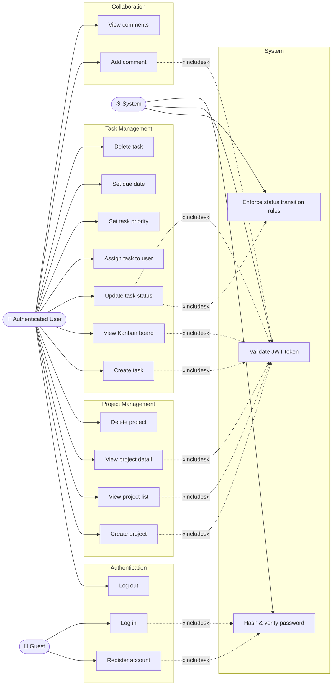
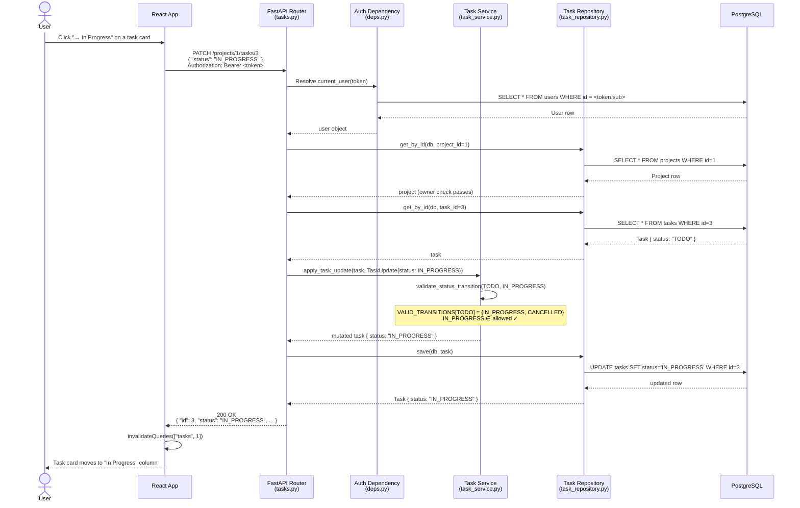
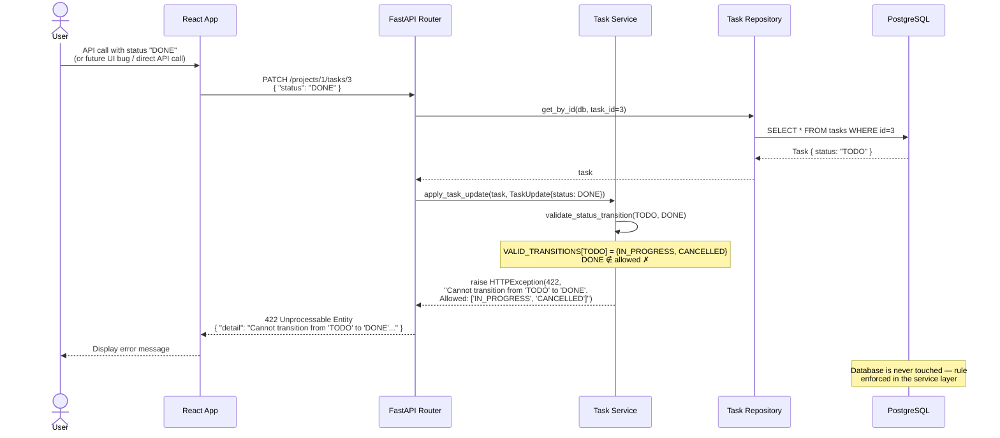
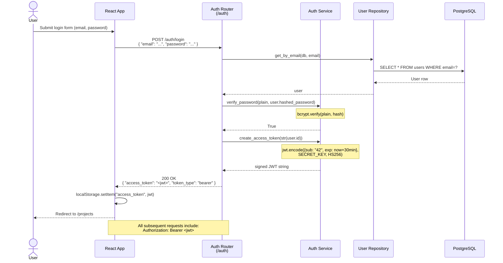
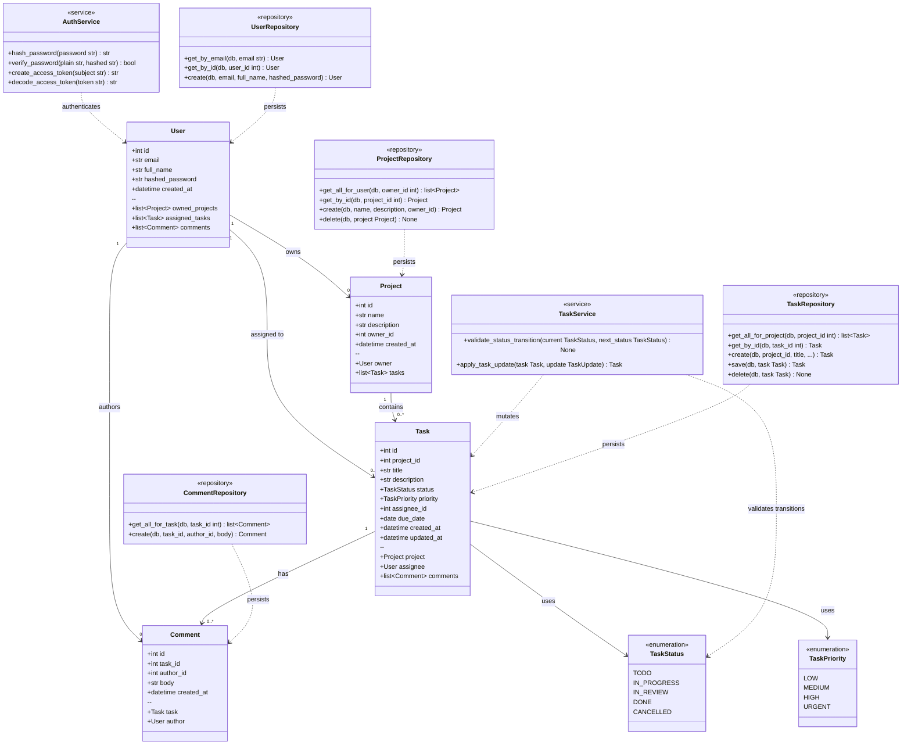
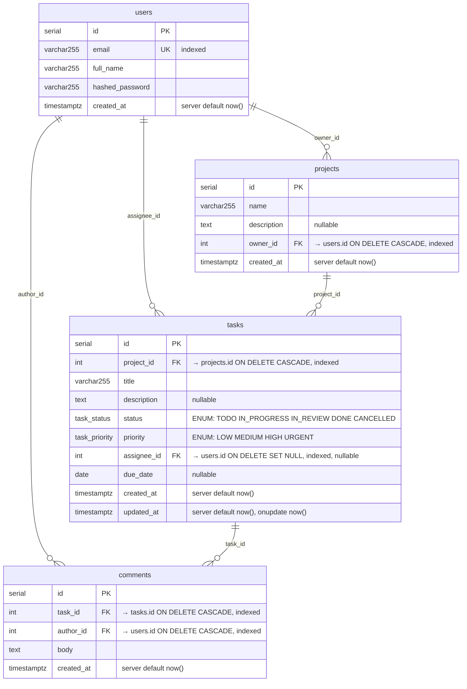

# UML Diagrams — Task Manager

All diagrams are written in [Mermaid](https://mermaid.js.org/) and render natively in GitHub, VS Code (with the Mermaid Preview extension), and Claude Code.

---

## 1. Architecture Diagram

Shows how the three tiers, Docker Compose, and the CI/CD pipeline fit together.

---

## 2. Use Case Diagram

Shows what each actor can do in the system. Mermaid does not have a native use-case diagram type; this uses a directed graph with actor and use-case shapes.

---

## 3. Sequence Diagrams

### 3a. Happy Path — Task Status Transition (TODO → IN_PROGRESS)

### 3b. Error Path — Invalid Status Transition (TODO → DONE)

### 3c. Authentication Flow — Login and Token Usage

---

## 4. Class Diagram

Shows the domain model, service layer, and repository layer with their relationships.

---

## 5. Entity Relationship Diagram

Shows the PostgreSQL schema — tables, columns, data types, and foreign key relationships.

---

## Diagram Summary

| Diagram | Type | What it shows |
|---------|------|---------------|
| Architecture | Flowchart | Three tiers, Docker Compose ports, CI/CD jobs |
| Use Case | Graph | What each actor (Guest / Auth User) can do |
| Sequence 3a | Sequence | Valid task status transition — happy path |
| Sequence 3b | Sequence | Invalid status transition — 422 error path |
| Sequence 3c | Sequence | Login flow and JWT issuance |
| Class | Class | Domain models, service layer, repository layer |
| ER | Entity-Relationship | PostgreSQL schema with columns and foreign keys |
