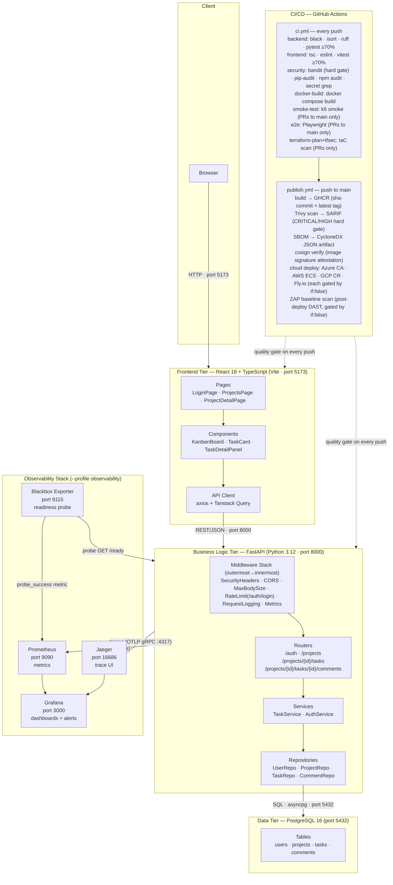
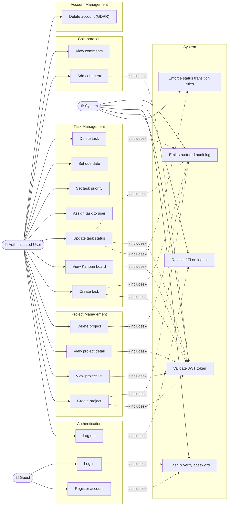
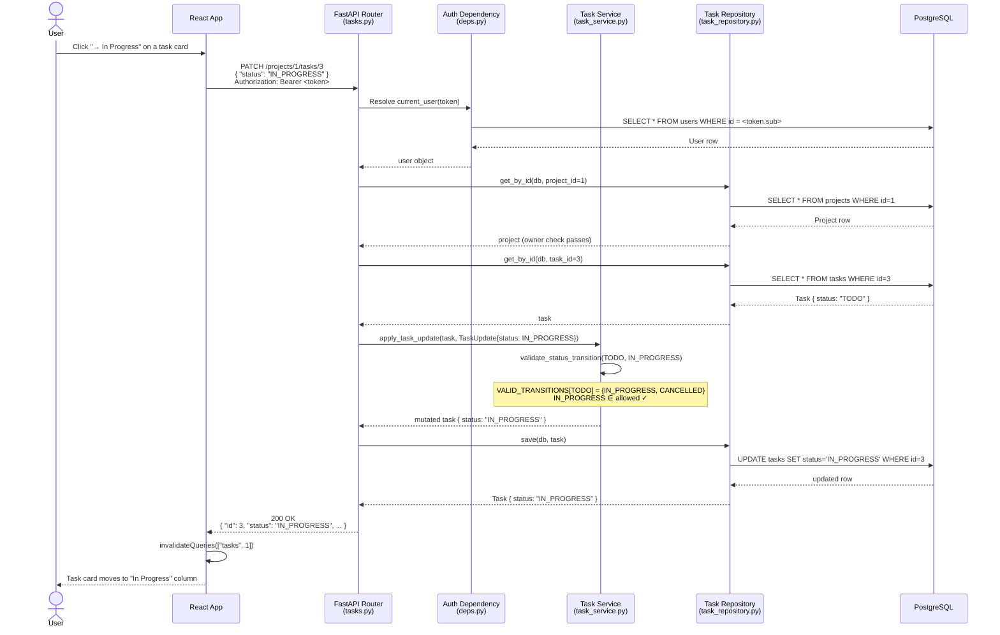
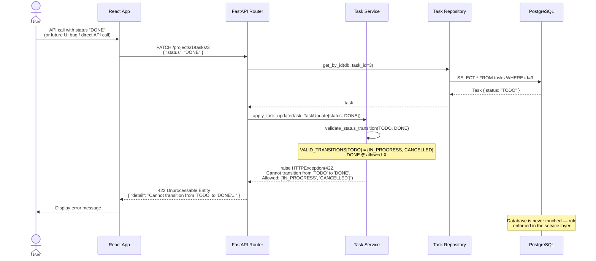
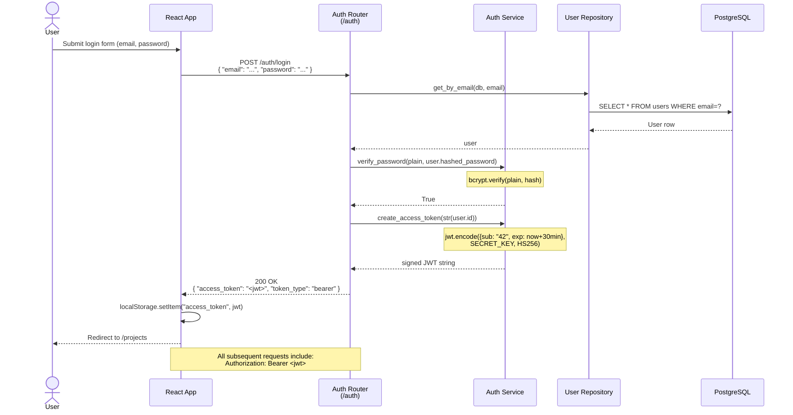
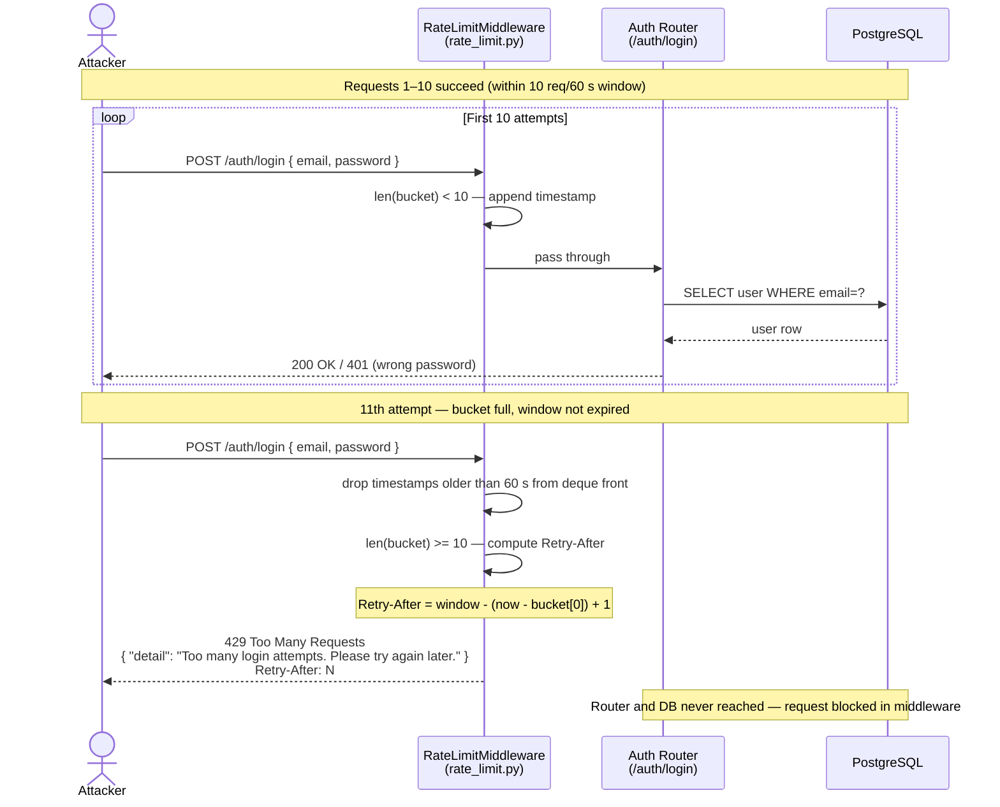
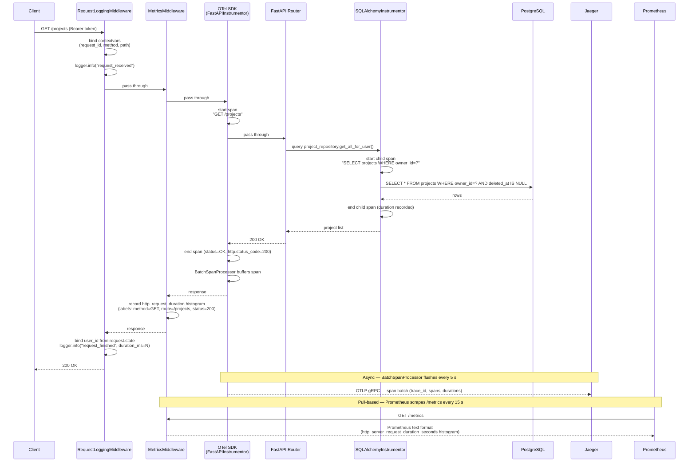
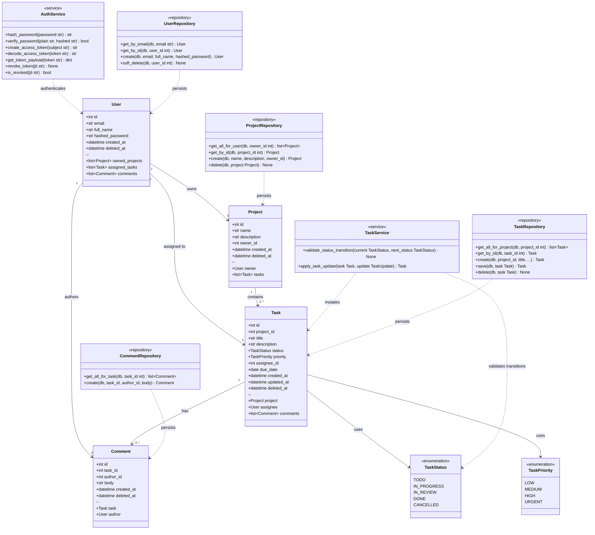
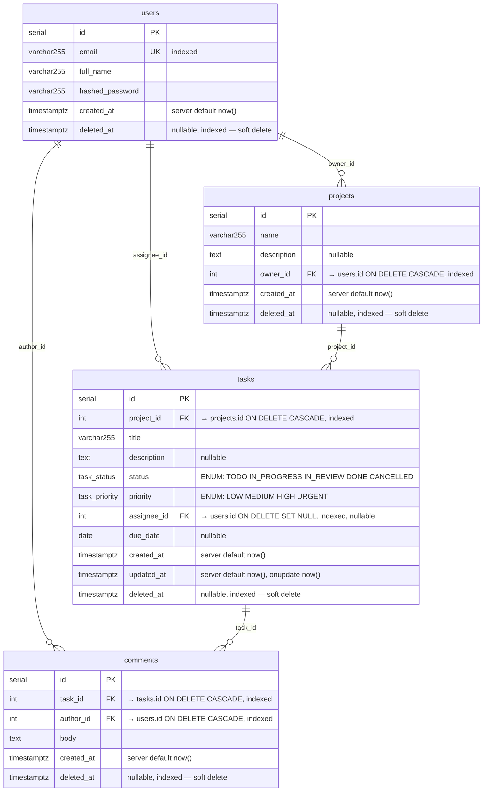

# UML Diagrams — Task Manager

All diagrams are written in [Mermaid](https://mermaid.js.org/) and render natively in GitHub, VS Code (with the Mermaid Preview extension), and Claude Code.

---

## 1. Architecture Diagram

Shows how the three tiers, .NET Aspire (preferred local dev) / Docker Compose, and the CI/CD pipeline fit together.



---

## 2. Use Case Diagram

Shows what each actor can do in the system. Mermaid does not have a native use-case diagram type; this uses a directed graph with actor and use-case shapes.



---

## 3. Sequence Diagrams

### 3a. Happy Path — Task Status Transition (TODO → IN_PROGRESS)



### 3b. Error Path — Invalid Status Transition (TODO → DONE)



### 3c. Authentication Flow — Login and Token Usage



### 3d. Logout and Token Revocation

```mermaid
sequenceDiagram
    actor User
    participant React as React App
    participant AuthRouter as Auth Router
    participant Deps as Auth Dependency
    participant AuthService as Auth Service

    User->>React: Click "Log out"
    React->>AuthRouter: POST /auth/logout<br/>Authorization: Bearer &lt;jwt&gt;
    AuthRouter->>Deps: current_user(request, credentials)
    Deps->>AuthService: get_token_payload(token)
    AuthService-->>Deps: {sub: "42", exp: ..., jti: "uuid-xyz"}
    Deps-->>AuthRouter: user, request.state.jti = "uuid-xyz"
    AuthRouter->>AuthService: revoke_token("uuid-xyz")
    Note over AuthService: _revoked_jtis.add("uuid-xyz")
    AuthService-->>AuthRouter: (void)
    AuthRouter-->>React: 204 No Content
    React->>React: localStorage.removeItem("access_token")
    React-->>User: Redirect to /login

    Note over React,AuthService: Subsequent request with the same token:
    React->>AuthRouter: GET /projects<br/>Authorization: Bearer &lt;same-jwt&gt;
    AuthRouter->>Deps: current_user(request, credentials)
    Deps->>AuthService: is_revoked("uuid-xyz") → True
    Deps-->>AuthRouter: raise 401 "Token has been revoked"
    AuthRouter-->>React: 401 Unauthorized
```

### 3e. GDPR Account Deletion

```mermaid
sequenceDiagram
    actor User
    participant React as React App
    participant AuthRouter as Auth Router
    participant Deps as Auth Dependency
    participant UserRepo as User Repository
    participant DB as PostgreSQL

    User->>React: Request account deletion
    React->>AuthRouter: DELETE /auth/users/me<br/>Authorization: Bearer &lt;jwt&gt;
    AuthRouter->>Deps: current_user(request, credentials)
    Deps-->>AuthRouter: user object (id=42)
    AuthRouter->>UserRepo: soft_delete(db, user_id=42)
    UserRepo->>DB: UPDATE users SET deleted_at=NOW() WHERE id=42
    DB-->>UserRepo: 1 row updated
    Note over DB: Record marked deleted; data retained for audit trail
    AuthRouter-->>React: 204 No Content

    Note over React,DB: Subsequent login attempt:
    React->>AuthRouter: POST /auth/login {email, password}
    AuthRouter->>UserRepo: get_by_email(db, email)
    UserRepo->>DB: SELECT ... WHERE email=? AND deleted_at IS NULL
    DB-->>UserRepo: (empty — user is soft-deleted)
    UserRepo-->>AuthRouter: None
    AuthRouter-->>React: 401 "Invalid credentials"
```

### 3f. Rate-Limited Login (429 Too Many Requests)

Shows the sliding-window rate limiter intercepting a brute-force credential stuffing attempt before the request reaches the auth router. See ADR 0007.



### 3g. Observability — Request Instrumentation Flow

Shows how a single API request generates a structured log entry, a distributed trace (sent to Jaeger), and a metrics data point (scraped by Prometheus). See ADR 0006.



---

## 4. Class Diagram

Shows the domain model, service layer, and repository layer with their relationships.



> **Soft-delete note:** `ProjectRepository.delete()` and `TaskRepository.delete()` set `deleted_at` to the current UTC timestamp — they do **not** issue a SQL `DELETE`. `UserRepository` names this `soft_delete()` to make the intent explicit. All `get_*` queries filter `WHERE deleted_at IS NULL`. See ADR 0004.

---

## 5. Entity Relationship Diagram

Shows the PostgreSQL schema — tables, columns, data types, and foreign key relationships.



---

## Diagram Summary

| Diagram | Type | What it shows |
|---------|------|---------------|
| Architecture | Flowchart | Three tiers, middleware execution order, CI (ci.yml) and CD (publish.yml) pipelines, observability stack |
| Use Case | Graph | What each actor (Guest / Auth User / System) can do, including GDPR deletion and audit logging |
| Sequence 3a | Sequence | Valid task status transition — happy path |
| Sequence 3b | Sequence | Invalid status transition — 422 error path |
| Sequence 3c | Sequence | Login flow and JWT issuance |
| Sequence 3d | Sequence | Logout and JTI token revocation |
| Sequence 3e | Sequence | GDPR account deletion (soft delete) |
| Sequence 3f | Sequence | Rate-limited login — 429 Too Many Requests (sliding-window, ADR 0007) |
| Sequence 3g | Sequence | Observability instrumentation — structured log + OTel trace + Prometheus metric per request (ADR 0006) |
| Class | Class | Domain models, service layer, repository layer; soft-delete note on delete() methods |
| ER | Entity-Relationship | PostgreSQL schema with columns, foreign keys, and soft-delete fields on all four tables |
