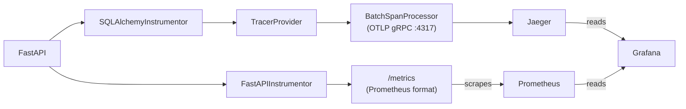

# Module 05b — Observability (Logs · Metrics · Traces)

## Learning Objectives

- Understand the three pillars of observability: **Logs**, **Metrics**, **Traces**
- Read structured JSON logs with request IDs for log correlation
- Distinguish a liveness probe (`/health`) from a readiness probe (`/ready`)
- Instrument a FastAPI service with **OpenTelemetry** (OTel) to emit metrics and traces
- Scrape metrics from the API with **Prometheus** and query them
- Visualise distributed traces in **Jaeger**
- Build a live dashboard in **Grafana** combining Prometheus metrics and Jaeger traces
- Correlate a log line to its trace using `trace_id`

---

## The Three Pillars of Observability

| Pillar | Question it answers | Tool in this lab |
|--------|-------------------|-----------------|
| **Logs** | What happened, and when? | `structlog` (JSON output) |
| **Metrics** | How often / how fast? | OpenTelemetry SDK → Prometheus |
| **Traces** | Which code path did this request take? | OpenTelemetry SDK → Jaeger |

All three are active in this lab. Grafana is the unified front-end that reads from both Prometheus and Jaeger.



---

## Background: Structured Logging

Plain-text logs are written for humans:
```
INFO:     127.0.0.1:55432 - "PATCH /projects/1/tasks/3 HTTP/1.1" 422
```

Structured JSON logs are written for machines — and machines can query them:
```json
{
  "event": "request_finished",
  "method": "PATCH",
  "path": "/projects/1/tasks/3",
  "status_code": 422,
  "duration_ms": 12.4,
  "request_id": "a3f2b1c4-…",
  "trace_id": "4bf92f3577b34da6a3ce929d0e0e4736",
  "span_id": "00f067aa0ba902b7",
  "level": "info"
}
```

`trace_id` and `span_id` are injected by `RequestLoggingMiddleware` after the OTel span is created. They let Grafana link from a log line directly to the Jaeger trace.

---

## What the Starter Code Added

Read these files before the activities:

| File | What it does |
|------|-------------|
| `app/logging_config.py` | Configures `structlog` — JSON in production, coloured in development |
| `app/middleware/logging.py` | Generates `request_id` per request; injects `trace_id`/`span_id` from OTel |
| `app/middleware/metrics.py` | In-process MetricsMiddleware (wall-clock timing; used before OTel) |
| `app/telemetry.py` | `setup_telemetry()` — wires OTel SDK, FastAPIInstrumentor, SQLAlchemyInstrumentor, mounts `/metrics` |
| `app/config.py` | `OTLP_ENDPOINT` and `OTEL_ENABLED` settings (env vars) |
| `app/main.py` | Calls `setup_telemetry()` on startup when `OTEL_ENABLED=true` |
| `observability/prometheus.yml` | Prometheus scrape config targeting `api:8000/metrics` |
| `observability/grafana/` | Pre-provisioned Grafana data sources and dashboard |

---

## Activities

### 1. Start the full observability stack

The observability services (Jaeger, Prometheus, Grafana) run under a Docker Compose profile so they don't slow down normal development:

```bash
docker compose --profile observability up
```

This starts seven containers:

| Container | URL | Purpose |
|-----------|-----|---------|
| `api` | http://localhost:8000 | FastAPI (emits traces + metrics) |
| `db` | localhost:5432 | PostgreSQL |
| `frontend` | http://localhost:5173 | React UI |
| `jaeger` | http://localhost:16686 | Trace storage + UI |
| `prometheus` | http://localhost:9090 | Metrics storage + UI |
| `grafana` | http://localhost:3000 | Unified dashboard (admin/admin) |
| `blackbox-exporter` | http://localhost:9115 | External endpoint prober (powers the `DatabaseUnreachable` Grafana alert) |

Wait for all containers to be healthy, then generate some traffic:

```bash
# Register a user and get a token
# Password must be 8+ chars with at least one uppercase letter and one digit
curl -s -X POST http://localhost:8000/auth/register \
  -H "Content-Type: application/json" \
  -d '{"email":"obs@example.com","full_name":"Obs User","password":"Obs1234!"}'

TOKEN=$(curl -s -X POST http://localhost:8000/auth/login \
  -H "Content-Type: application/json" \
  -d '{"email":"obs@example.com","password":"Obs1234!"}' \
  | python3 -c "import sys,json; print(json.load(sys.stdin)['access_token'])")

# Create a project and task
PROJECT=$(curl -s -X POST http://localhost:8000/projects \
  -H "Authorization: Bearer $TOKEN" -H "Content-Type: application/json" \
  -d '{"name":"Obs Project"}' | python3 -c "import sys,json; print(json.load(sys.stdin)['id'])")

TASK=$(curl -s -X POST http://localhost:8000/projects/$PROJECT/tasks \
  -H "Authorization: Bearer $TOKEN" -H "Content-Type: application/json" \
  -d '{"title":"Obs Task","priority":"HIGH"}' \
  | python3 -c "import sys,json; print(json.load(sys.stdin)['id'])")

# Trigger a valid transition and an invalid one (422)
curl -s -X PATCH http://localhost:8000/projects/$PROJECT/tasks/$TASK \
  -H "Authorization: Bearer $TOKEN" -H "Content-Type: application/json" \
  -d '{"status":"IN_PROGRESS"}' > /dev/null

curl -s -X PATCH http://localhost:8000/projects/$PROJECT/tasks/$TASK \
  -H "Authorization: Bearer $TOKEN" -H "Content-Type: application/json" \
  -d '{"status":"DONE"}'   # Invalid: IN_PROGRESS → DONE is not allowed
```

### 2. Explore the Prometheus metrics endpoint

The API now exposes Prometheus-format metrics instead of the old JSON counter:

```bash
curl http://localhost:8000/metrics
```

You'll see output like:
```
# HELP http_server_request_duration_seconds Duration of HTTP server requests
# TYPE http_server_request_duration_seconds histogram
http_server_request_duration_seconds_bucket{http_request_method="GET",http_route="/health",http_response_status_code="200",le="0.005"} 3.0
http_server_request_duration_seconds_bucket{...
http_server_request_duration_seconds_count{http_request_method="PATCH",...} 2.0
http_server_request_duration_seconds_sum{...} 0.045
```

This is the Prometheus **exposition format**. Prometheus scrapes this endpoint every 15 seconds.

Ask Claude Code:
> "Explain what a Prometheus histogram bucket is and why the `http_server_request_duration_seconds` metric uses buckets rather than just recording the raw latency."

### 3. Query Prometheus

Open http://localhost:9090 and try these PromQL queries in the **Graph** tab:

**Request rate per second (1-minute window):**
```promql
sum(rate(http_server_request_duration_seconds_count{job="task-manager-api"}[1m]))
```

**Error rate percentage (5xx only):**
```promql
100 * sum(rate(http_server_request_duration_seconds_count{
  job="task-manager-api",
  http_response_status_code=~"5.."
}[1m])) / sum(rate(http_server_request_duration_seconds_count{job="task-manager-api"}[1m]))
```

**P95 request latency in milliseconds:**
```promql
histogram_quantile(0.95, sum(rate(http_server_request_duration_seconds_bucket{
  job="task-manager-api"
}[5m])) by (le)) * 1000
```

**Requests broken down by endpoint:**
```promql
sum by (http_route, http_request_method) (rate(http_server_request_duration_seconds_count{
  job="task-manager-api"
}[1m]))
```

Check **Status → Targets** to confirm the API scrape target shows `UP`.

Ask Claude Code:
> "What's the difference between a Prometheus counter, gauge, and histogram? Give me an example of when you'd use each one in the Task Manager API."

### 4. Explore distributed traces in Jaeger

Open http://localhost:16686.

1. Select **Service: task-manager-api** from the dropdown
2. Click **Find Traces**
3. Click on one of the `PATCH /projects/{project_id}/tasks/{task_id}` traces

You'll see a **waterfall view** showing:
- The outer HTTP span (request duration)
- Child spans for each SQLAlchemy query (with exact SQL)
- The `enable_commenter=True` setting appends `/* action='PATCH /tasks/{id}' */` to SQL queries

Look for a trace from the invalid transition (422). Notice:
- The span status is `ERROR`
- There's no DB write span (the check fails before reaching the repository)

Ask Claude Code:
> "In the Jaeger trace for the PATCH /tasks endpoint, I can see the SQLAlchemy SELECT span but no INSERT or UPDATE. Why? Walk me through the code path from the router to the service to the repository."

### 5. Open the pre-provisioned Grafana dashboard

Open http://localhost:3000 and log in as **admin / admin**.

Navigate to **Dashboards → Task Manager API**. You'll see:

| Panel | What it shows |
|-------|--------------|
| Request Rate | Requests per second (real-time) |
| Error Rate % | Percentage of 5xx responses |
| P95 Latency | 95th percentile latency in ms |
| Active Requests | In-flight requests right now |
| Request Rate by Endpoint | Per-route breakdown |
| Latency Percentiles | p50 / p95 / p99 over time |
| HTTP Errors Over Time | 4xx and 5xx error rates |
| Recent Traces | Latest traces from Jaeger |

Generate load (repeat the curl commands from Activity 1 several times) and watch the panels update.

Ask Claude Code:
> "The P95 latency panel uses `histogram_quantile(0.95, ...)`. Why can't I just record the exact latency of every request and compute percentiles directly? What's the trade-off Prometheus makes here?"

### 6. Trace a log line to its Jaeger trace

The `RequestLoggingMiddleware` injects `trace_id` and `span_id` into every log line so you can jump from logs to traces.

```bash
# Watch logs in structured format
docker compose logs -f api | python3 -c "
import sys, json
for line in sys.stdin:
    try:
        print(json.dumps(json.loads(line), indent=2))
    except:
        print(line, end='')
" | grep -A 10 '"event": "request_finished"'
```

Copy a `trace_id` value (it looks like `4bf92f3577b34da6a3ce929d0e0e4736`).

In Jaeger, click **Trace ID** in the top bar and paste the ID. You'll land directly on the trace for that log line.

This is **log-trace correlation** — moving between the log system and the trace system with a single ID.

Ask Claude Code:
> "In a microservices architecture where the frontend calls the API which calls an external payment service, how would the trace_id flow through all three systems? What HTTP header is standardised for this?"

### 7. Add custom business metrics

There are two ways to add custom metrics to this project. Understanding both teaches you when each is appropriate.

#### Approach A — Direct `prometheus_client` Counter (for application-level business events)

The `prometheus_client` library lets you define counters that are served directly by the `/metrics` endpoint — no OTel pipeline needed. Use this for **business-level counters** that represent meaningful domain events (tasks created, users registered, projects deleted).

Create `backend/app/business_metrics.py`:

```python
from prometheus_client import Counter

tasks_created_total = Counter(
    "tasks_created_total",
    "Total number of tasks successfully created",
)

projects_created_total = Counter(
    "projects_created_total",
    "Total number of projects successfully created",
)
```

Then increment the counter in the router after a successful creation:

```python
# backend/app/routers/tasks.py
from app.business_metrics import tasks_created_total

# ... inside create_task(), after task_repository.create():
logger.info("audit", action="TASK_CREATED", resource="task", resource_id=task.id)
tasks_created_total.inc()
return task
```

After implementing, create a task and verify the counter in Prometheus:
```promql
tasks_created_total
```

Watch it increment in real time as you create more tasks:
```promql
rate(tasks_created_total[5m])
```

#### Approach B — OTel Counter (for infrastructure-level spans and metrics)

The OTel SDK adds custom metrics to the same pipeline as the auto-instrumented spans. Use this when you want metrics that correlate with trace spans and carry OTel attributes.

Ask Claude Code:
> "Add a custom OpenTelemetry counter named `task_status_transitions_total` to `app/services/task_service.py`. The counter should have attributes: `from_status` and `to_status`. Use the global MeterProvider. Increment it each time a task status changes successfully."

> **Reference implementation:** `task_status_transitions_total` is implemented as a `prometheus_client.Counter` in `backend/app/business_metrics.py` and incremented in `backend/app/services/task_service.py::apply_task_update()` after every successful status transition. It's tested in `backend/tests/test_observability.py::test_task_status_transitions_counter_in_metrics`.

#### When to use each

| Approach | Use when |
|----------|----------|
| `prometheus_client.Counter` | Domain events you want to count forever (all-time totals, business KPIs) |
| OTel `MeterProvider` | Infrastructure metrics you want correlated with trace spans and OTel attributes |

Ask Claude Code:
> "The project now has two types of custom metrics: `prometheus_client.Counter` in `business_metrics.py` and OTel counters in the service layer. Both appear at `/metrics`. What is the difference between them at the Prometheus level? Is there any risk of naming collision?"

### 8. Explore the pre-provisioned Grafana alert rules

The observability stack ships with four alert rules in `observability/grafana/provisioning/alerting/rules.yaml`. Open Grafana → **Alerting → Alert Rules** to see them:

| Alert | Condition | Severity |
|-------|-----------|----------|
| `HighErrorRate` | 5xx rate > 5% for 5 min | Critical |
| `HighLatency` | P95 > 500 ms for 5 min | Warning |
| `DatabaseUnreachable` | `/ready` probe fails for 1 min | Critical |
| `HighRejectionRate` | 429 rate > 50/min for 2 min | Warning (brute-force signal) |

The `DatabaseUnreachable` alert works through the **Prometheus Blackbox Exporter** — a separate container that probes `http://api:8000/ready` and exposes the result as the metric `probe_success{job="readiness"}`. Prometheus scrapes the Blackbox Exporter, and Grafana fires the alert when `probe_success == 0` for more than 1 minute.

Trigger the alert manually to verify the pipeline works:

```bash
# Stop the DB — /ready will return 503 within seconds
docker compose stop db
```

Wait 60 seconds, then check Grafana → **Alerting → Alert Rules** — `DatabaseUnreachable` should enter **Firing** state. Restart the DB to resolve it:

```bash
docker compose up db -d
```

Ask Claude Code:
> "Why is a separate Blackbox Exporter needed to power the DatabaseUnreachable alert? Why can't Prometheus just scrape /ready directly and alert on the HTTP status code?"

### 9. Understand the liveness vs. readiness probes

Stop the database while the API is still running:

```bash
docker compose stop db
curl http://localhost:8000/health   # 200 — process is alive, independent of DB
curl http://localhost:8000/ready    # 503 — DB is unreachable
```

**Liveness** (`/health`): the container orchestrator restarts the container if this fails. Never make it depend on external services or you'll get a restart loop.

**Readiness** (`/ready`): the load balancer stops routing traffic to this instance if this fails. Safe to check DB, cache, downstream services.

Restart the database:
```bash
docker compose up db -d
```

Ask Claude Code:
> "In Kubernetes, what is the difference between a liveness probe, a readiness probe, and a startup probe? When would you use all three on the same container?"

### 10. Add user context to logs

The middleware logs every request, but not who made it. Add the authenticated user's ID to the structlog context:

Ask Claude Code:
> "Update the `current_user` dependency in app/routers/deps.py to call `structlog.contextvars.bind_contextvars(user_id=str(current_user.id))` after resolving the user. This way every log line emitted during an authenticated request automatically includes the user ID."

After implementing, make an authenticated request and verify `user_id` appears alongside `request_id` and `trace_id` on the `request_finished` log line.

### 11. Synthetic monitoring with Blackbox Exporter

Internal OTel metrics (histograms, counters) are emitted from inside the process. If the process crashes, the metric pipeline goes silent — you only know something is wrong when you notice the absence of data. **Synthetic monitoring** probes from outside the process, so a crash, network partition, or VM failure produces an explicit `probe_success = 0` rather than silence.

The `blackbox-exporter` container is already running in the observability stack (Activity 1). It probes `http://api:8000/ready` on a schedule and exposes the result as a Prometheus metric:

```bash
# Query the Blackbox Exporter directly
curl http://localhost:9115/probe?target=http://api:8000/ready&module=http_2xx
# Key metrics in the response:
#   probe_success 1        — probe passed (1) or failed (0)
#   probe_duration_seconds — how long the probe took
```

Prometheus scrapes the Blackbox Exporter via the `blackbox` job in `observability/prometheus/prometheus.yml` — no additional config needed.

**Add a `probe_success` panel to your Grafana dashboard:**

1. Open Grafana → Dashboards → Task Manager API → Edit
2. Add a new panel using the **Stat** visualization type
3. Query:
   ```promql
   probe_success{job="readiness"}
   ```
4. Set thresholds: `0` → Red, `1` → Green
5. Set the title to **Endpoint Availability (Blackbox)**
6. Save the dashboard

This panel shows at a glance whether the `/ready` endpoint is reachable from outside the API process. It is the probe that powers the `DatabaseUnreachable` alert — when `probe_success` drops to 0 for more than 60 seconds, the alert fires.

**Why synthetic probes complement internal metrics:**

| Signal source | What it catches | What it misses |
|---------------|----------------|---------------|
| OTel metrics (internal) | Slow queries, error rates, in-process crashes with graceful shutdown | Process that hard-crashes (no more metrics emitted) |
| Blackbox Exporter (external) | Complete outage, network partition, port not listening | Internal slowdowns that don't fail the probe |

Together they cover each other's blind spots.

Ask Claude Code:
> "The Blackbox Exporter probes `/ready` which tests DB connectivity. If the API process is up but the DB is down, `probe_success` will be 0. Design a second probe targeting `/health` (process-only). What PromQL alert rule would distinguish 'DB is down but API is alive' from 'entire API container is gone'?"

---

## Observability Checklist — Production Readiness

| Check | How to verify |
|-------|--------------|
| All log lines are JSON | `docker compose logs api \| python3 -m json.tool` parses cleanly |
| Every request has `request_id` and `trace_id` | Check log output after Activity 9 |
| `/health` responds in <5 ms | `curl -w "\nTime: %{time_total}s\n" http://localhost:8000/health` |
| `/ready` returns 503 when DB is down | Activity 8 |
| Prometheus shows the API as a healthy scrape target | **Status → Targets** in Prometheus UI |
| Jaeger shows spans with DB child spans | Activity 4 |
| Grafana dashboard shows live data | Activity 5 |
| No secrets appear in any log line | Review log output — no passwords, tokens, or full JWTs |

---

## Checkpoint

- [ ] `docker compose --profile observability up` starts all seven containers without errors (including `blackbox-exporter`)
- [ ] `curl http://localhost:8000/metrics` returns Prometheus text format (not JSON)
- [ ] Prometheus **Status → Targets** shows `task-manager-api` as `UP`
- [ ] Jaeger shows traces for your PATCH requests, including DB child spans
- [ ] Grafana **Task Manager API** dashboard shows live metrics
- [ ] You traced a log line to its Jaeger trace using the `trace_id` (Activity 6)
- [ ] `tasks_created_total` counter visible in Prometheus; increments on `POST /projects/{id}/tasks` (Activity 7A)
- [ ] `task_status_transitions_total` OTel counter visible in Prometheus with `from_status`/`to_status` labels (Activity 7B)
- [ ] `pytest tests/test_observability.py` passes — two test modes are covered: (1) standard `client` fixture with `OTEL_ENABLED=false` (verifies `/metrics` returns 404 when OTel is not configured); (2) `otel_client` module-scoped fixture with OTel enabled (verifies `/metrics` returns 200 with Prometheus text format, and that `http_server_duration` and `task_status_transitions_total` metrics are present)
- [ ] No secrets appear in any log line
- [ ] Grafana alert rules are visible under **Alerting → Alert Rules** (all four rules shown)
- [ ] `DatabaseUnreachable` alert fires when DB is stopped (Activity 8)
- [ ] `probe_success{job="readiness"}` Stat panel added to Grafana dashboard — shows green (1) when `/ready` is healthy, red (0) when it fails (Activity 11)
- [ ] Commit: `feat(observability): add OTel tracing + Prometheus metrics + business counters + Grafana dashboard + alerting + synthetic probe panel`
