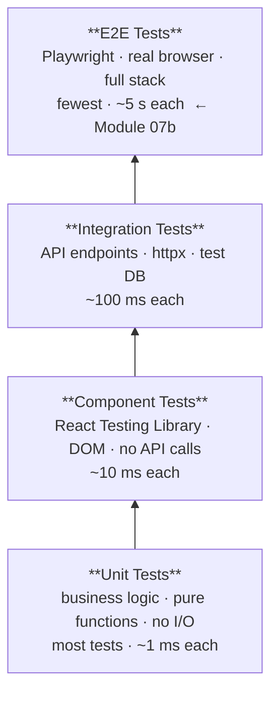

# Module 7 — Testing (Unit, Integration, Component)

## Learning Objectives

- Write tests that verify behaviour, not just coverage numbers
- Understand the four levels of the test pyramid and when to use each
- Use Claude Code to find gaps in your test suite

## The Test Pyramid



| Level | Speed | Confidence | When to write |
|-------|-------|-----------|---------------|
| Unit | ~1 ms/test | High for logic | Always — for every business rule |
| Integration | ~100 ms/test | High for plumbing | Key API flows and DB interactions |
| Component | ~10 ms/test | High for UI logic | Every interactive component |
| E2E | ~5 s/test | Highest (real browser) | Critical user journeys only |

**Rule:** Most tests should be unit tests. E2E tests are expensive — write them only for the flows that must never break (login, create task, status transition).

---

## Backend — Unit Tests

Unit tests run without a database, a network, or Docker. They test pure Python logic.

### Run existing tests

> **Python version:** The backend requires Python 3.12. If your system runs a different version, use the Docker runner described in `README.md → Running Tests → Backend`. For unit-only tests that don't need the database, you can run them in any 3.12 environment.

```bash
cd backend
pip install -e ".[dev]"
pytest tests/test_task_service.py tests/test_auth_service.py -v
```

Look at `tests/test_task_service.py`. Notice:

- `make_task()` constructs a `Task` object directly — no DB, no `async`, no fixtures
- Each test case covers one specific scenario
- The test names read like specifications: `test_todo_to_done_raises`

### Write a new unit test

The `apply_task_update` function has a case not yet covered: what happens when `description` is explicitly set to an empty string?

Ask Claude Code:
> "Write a pytest unit test for apply_task_update that verifies: when description is set to an empty string, the task's description is updated to '' (not None, not ignored)."

Add it to `tests/test_task_service.py`.

> **Existing coverage in `test_task_service.py`:** `test_updates_assignee_id` and `test_updates_due_date` cover the `assignee_id` and `due_date` optional-field paths in `apply_task_update` — previously untested coverage gaps.

### What makes a good unit test?

Ask Claude Code:
> "Look at tests/test_task_service.py. Which tests are the weakest — testing implementation details instead of behaviour? How would you rewrite them?"

---

## Backend — Integration Tests

Integration tests spin up the FastAPI app against a real PostgreSQL database (the same one used by the Docker Compose stack). They test that all the layers work together correctly over HTTP, using `httpx.AsyncClient` with `ASGITransport` — no HTTP port needed.

> **DB isolation:** The test suite sets `ENVIRONMENT=test` which tells `database.py` to use `NullPool` (one fresh connection per request, closed immediately). This avoids asyncpg "Future attached to a different loop" errors caused by Starlette's `BaseHTTPMiddleware` creating a new task per request.
>
> Run all tests (including integration) using the Docker runner to guarantee Python 3.12 and DB connectivity:
> ```bash
> docker run --rm --network task-manager_default \
>   -e DATABASE_URL="postgresql+asyncpg://taskuser:taskpass@db:5432/taskmanager" \
>   -e SECRET_KEY="test-secret-key-for-local-dev-only" \
>   -e ENVIRONMENT=test -e OTEL_ENABLED=false \
>   -v "$(pwd)/backend:/app" python:3.12-slim \
>   bash -c "pip install -e '.[dev]' -q && pytest tests/ --cov=app --cov-report=term-missing -v"
> ```

### Write an integration test

Ask Claude Code:
> "Write an integration test in tests/test_tasks_integration.py using httpx.AsyncClient and the conftest fixtures that:
>
> 1. Registers a user via POST /auth/register
> 2. Logs in via POST /auth/login to get a token
> 3. Creates a project via POST /projects
> 4. Creates a task in that project
> 5. Attempts to PATCH the task status directly from TODO to DONE
> 6. Asserts the response is 422 with an error message mentioning the invalid transition"

Look at `tests/conftest.py` to understand how the test client and database are set up before writing the test yourself.

### Writing auth endpoint tests

See `tests/test_auth_endpoints.py` for patterns used in the 11 integration tests covering register/login/logout/delete-account. Key patterns:

- Use unique emails per test: `f"auth_{uuid.uuid4().hex[:8]}@example.com"` — avoids conflicts across test runs
- Passwords must satisfy the validator: ≥8 chars, one uppercase, one digit (use `"Pass1234"`)
- Test token revocation: call logout, then assert the same token returns 401
- Test soft delete: delete account, then assert login and token use both return 401

`tests/test_auth_integration.py` extends the auth coverage with security-focused tests grouped by class:

| Class | Tests | What they verify |
|-------|-------|-----------------|
| `TestRegister` | 4 | Weak/empty/invalid email → 422; `hashed_password` not exposed in response |
| `TestLogin` | 1 | User enumeration: identical error for wrong email vs wrong password |
| `TestProtectedEndpoints` | 4 | Invalid token → 401; `alg:none` attack → 401; expired JWT → 401; token with no `sub` claim → 401 |

`tests/test_security.py` covers transport-layer security properties that mirror what the pen test script checks automatically:

| Class | Tests | What they verify |
|-------|-------|-----------------|
| `TestPasswordValidator` | 3 | Pydantic validator directly: no-uppercase raises, no-digit raises, strong password accepted |
| `TestCORS` | 4 | Disallowed origin not reflected; allowed origin reflected; preflight ACAO headers; preflight disallowed origin not reflected |
| `TestResponseHeaders` | 2 | `server` header doesn't contain framework/version; `x-powered-by` absent |

### Check coverage

```bash
ENVIRONMENT=test pytest --cov=app --cov-report=html
open htmlcov/index.html   # macOS
# xdg-open htmlcov/index.html  # Linux
```

Find a file below 70%. Ask Claude Code:
> "Which lines in app/routers/projects.py are not covered by tests? Write integration tests to cover the DELETE /projects/{id} endpoint."

---

## Frontend — Component Tests

Component tests render a React component into a virtual DOM and assert on what the user would see and interact with. There is no real browser and no API calls.

### Run existing tests

```bash
cd frontend
npm test
```

Look at `src/components/TaskCard.test.tsx`:

- Task data is created as a plain TypeScript object — no API call
- `vi.fn()` creates a mock function so we can assert it was called with the right args
- Assertions use `@testing-library/jest-dom` matchers like `toBeInTheDocument()`

### Write a new component test

Ask Claude Code:
> "Write a Vitest component test for KanbanBoard that verifies:
>
> - When two tasks have status TODO and one has status IN_PROGRESS, the TODO column shows 2 tasks and the IN_PROGRESS column shows 1 task
> - Clicking the '→ In Progress' button on a TODO task calls onStatusChange with the correct taskId and 'IN_PROGRESS'"

### Testing with mock API (MSW)

`msw` (Mock Service Worker) intercepts network requests in tests so you can test components that call the API. Ask Claude Code:
> "Show me how to write a Vitest test for ProjectsPage.tsx using msw to mock GET /projects. The test should verify that a project named 'My Project' appears in the list after the mock returns it."

---

## Checkpoint

- [ ] Full backend test suite passes with coverage ≥ 70% (reference solution: 133 tests, 88%):
  ```bash
  docker run --rm --network task-manager_default \
    -e DATABASE_URL="postgresql+asyncpg://taskuser:taskpass@db:5432/taskmanager" \
    -e SECRET_KEY="test-secret-key-for-local-dev-only" \
    -e ENVIRONMENT=test -e OTEL_ENABLED=false \
    -v "$(pwd)/backend:/app" python:3.12-slim \
    bash -c "pip install -e '.[dev]' -q && pytest tests/ --cov=app --cov-report=term-missing -v"
  ```
- [ ] `npm test` passes with coverage ≥ 70%
- [ ] You've written at least one unit test, one integration test, and one component test
- [ ] Auth endpoint tests (`test_auth_endpoints.py`) all pass — including logout revocation and soft-delete flow
- [ ] Security-focused auth tests (`test_auth_integration.py`) pass — including `alg:none`, expired token, missing `sub`, and user-enumeration tests
- [ ] Transport security tests (`test_security.py`) pass — including CORS policy and server header tests
- [ ] Observability tests (`test_observability.py`) pass — including liveness/readiness, request ID, structured log fields, and OTel metrics
- [ ] Governance tests (`test_governance.py`) pass — including 10 audit event types (REGISTER, LOGIN_SUCCESS, LOGIN_FAILED, LOGOUT, USER_DELETED, PROJECT_CREATED, PROJECT_DELETED, TASK_CREATED, TASK_UPDATED, TASK_DELETED), rate limiting, and SECRET_KEY validator
- [ ] You ran `/code-review` on your test files and addressed at least one finding
- [ ] `/check-python` shows no lint violations in the test files
- [ ] `/check-standards` produces a full green report across both tiers
- [ ] Continue to **Module 07b** for E2E testing with Playwright

---

## Best Practice: AAA Pattern

Every test — unit, integration, or component — should follow **Arrange → Act → Assert**:

```python
def test_valid_transition():
    # Arrange
    task = make_task(status=TaskStatus.TODO)
    update = TaskUpdate(status=TaskStatus.IN_PROGRESS)

    # Act
    result = apply_task_update(task, update)

    # Assert
    assert result.status == TaskStatus.IN_PROGRESS
```

```tsx
it("calls onStatusChange when transition button is clicked", () => {
  // Arrange
  const onStatusChange = vi.fn();
  render(<TaskCard task={todoTask} onStatusChange={onStatusChange} />);

  // Act
  fireEvent.click(screen.getByText("→ In Progress"));

  // Assert
  expect(onStatusChange).toHaveBeenCalledWith(1, "IN_PROGRESS");
});
```
