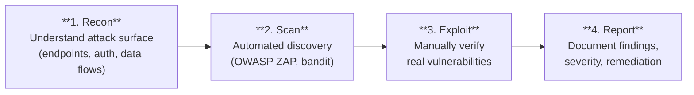

# Module 12 — Penetration Testing

## Authorization Notice

**Only test systems you own or have written permission to test.**

In this module you test your own running instance of the Task Manager application. Every check targets `http://localhost:8000`. Applying these techniques to any other system without authorization is illegal under the Computer Fraud and Abuse Act (US), the Computer Misuse Act (UK), and equivalent laws in most countries.

---

## Learning Objectives

- Understand the pen test lifecycle: recon → scan → exploit → report
- Use OWASP ZAP to perform an automated baseline scan
- Manually test for the OWASP Top 10 vulnerabilities in the context of this specific API
- Write a structured pen test report documenting findings, severity, and remediations
- Understand the difference between a vulnerability found in testing and one found in production

---

## Background: The Pen Test Lifecycle



This module follows that sequence for the Task Manager API.

---

## Tools

| Tool | Purpose | Install |
|------|---------|---------|
| OWASP ZAP | Automated baseline scan + active scan | Docker (no install needed) |
| `curl` | Manual HTTP testing | Built-in on macOS/Linux |
| `pen-tests/manual-checks.sh` | Automated manual checks (curl-based) | Already in repo |
| Burp Suite CE | Interactive proxy for manual interception | Optional; download from portswigger.net |

---

## Setup

Start the full application stack:
```bash
docker compose up -d
```

Verify the API is up and the endpoints are accessible:
```bash
curl http://localhost:8000/health
curl http://localhost:8000/docs   # Swagger UI — useful for recon
```

---

## Activities

### 1. Recon — Map the attack surface

Before using any tools, understand what you're testing. Open the Swagger UI at http://localhost:8000/docs.

For each endpoint, note:
- Is it protected (requires JWT) or public?
- What data does it accept and return?
- Which HTTP methods are allowed?

Ask Claude Code:
> "Read backend/app/routers/ and produce a table of every endpoint showing: HTTP method, path, whether it requires authentication, and what data it reads or writes. Highlight any endpoints that write data but aren't protected."

This table is your **attack surface map** — the foundation of the pen test. Key endpoints introduced in enterprise governance hardening:

| Endpoint | Auth required | What it does |
|----------|--------------|--------------|
| `POST /auth/logout` | Yes | Revokes the current token's JTI |
| `DELETE /auth/users/me` | Yes | Soft-deletes the authenticated user's account |
| `GET /ready` | No | Readiness probe — tests DB connectivity |

### 2. Automated scan — OWASP ZAP baseline

Run the ZAP baseline scan against your running API:

```bash
chmod +x pen-tests/zap-scan.sh
./pen-tests/zap-scan.sh http://localhost:8000
```

ZAP will:
1. Spider all discoverable paths
2. Passively analyse all responses for security headers, information leakage, and insecure patterns
3. Run a light active scan (safe probes — no destructive payloads in baseline mode)
4. Output an HTML and JSON report to `pen-tests/reports/`

Open the HTML report in a browser:
```bash
open pen-tests/reports/zap-report-*.html
```

Read each alert. ZAP categorises findings by risk level: **High**, **Medium**, **Low**, **Informational**.

Common findings for a FastAPI app:
- **Missing security headers** (X-Content-Type-Options, X-Frame-Options, CSP) — FastAPI doesn't add these by default; a reverse proxy (nginx) should
- **Application error disclosure** — stack traces in error responses
- **Absence of anti-CSRF tokens** — not applicable for JWT-based APIs (CSRF requires session cookies)

Ask Claude Code:
> "ZAP flagged 'Missing Anti-clickjacking Header' on the /docs endpoint. Why is this a risk for the Swagger UI specifically, even though the API itself uses JWT not session cookies?"

### 3. Manual testing — A01 Broken Access Control (IDOR)

IDOR (Insecure Direct Object Reference) is the most common A01 vulnerability in REST APIs. An attacker tries to access resource IDs they don't own.

```bash
# Create two users and get their tokens
EMAIL_A="test_a_$(date +%s)@test.local"
EMAIL_B="test_b_$(date +%s)@test.local"

curl -s -X POST http://localhost:8000/auth/register \
  -H "Content-Type: application/json" \
  -d "{\"email\":\"$EMAIL_A\",\"full_name\":\"Alice\",\"password\":\"Alice123!\"}"

curl -s -X POST http://localhost:8000/auth/register \
  -H "Content-Type: application/json" \
  -d "{\"email\":\"$EMAIL_B\",\"full_name\":\"Bob\",\"password\":\"Bob123!\"}"

TOKEN_A=$(curl -s -X POST http://localhost:8000/auth/login \
  -H "Content-Type: application/json" \
  -d "{\"email\":\"$EMAIL_A\",\"password\":\"Alice123!\"}" \
  | python3 -c "import sys,json; print(json.load(sys.stdin)['access_token'])")

TOKEN_B=$(curl -s -X POST http://localhost:8000/auth/login \
  -H "Content-Type: application/json" \
  -d "{\"email\":\"$EMAIL_B\",\"password\":\"Bob123!\"}" \
  | python3 -c "import sys,json; print(json.load(sys.stdin)['access_token'])")

# Alice creates a project
PROJECT_ID=$(curl -s -X POST http://localhost:8000/projects \
  -H "Authorization: Bearer $TOKEN_A" -H "Content-Type: application/json" \
  -d '{"name":"Alice Private Project"}' \
  | python3 -c "import sys,json; print(json.load(sys.stdin)['id'])")

echo "Alice's project ID: $PROJECT_ID"

# Bob attempts to access Alice's project (IDOR attempt)
echo "Bob accessing Alice's project:"
curl -v http://localhost:8000/projects/$PROJECT_ID \
  -H "Authorization: Bearer $TOKEN_B"
```

**Expected:** HTTP 404 — Bob cannot see Alice's project. The implementation returns 404 (not 403) intentionally: returning 403 would confirm the resource exists, leaking information to an attacker. Always returning 404 for resources the caller doesn't own prevents enumeration.

**Vulnerable result:** HTTP 200 — Bob can see Alice's data.

If the endpoint is vulnerable, trace the code path:
```
routers/projects.py → get_project() → project_repository.get_by_id()
```

The repository query must include `WHERE owner_id = current_user.id`. If it only does `WHERE id = ?`, it's an IDOR.

Ask Claude Code:
> "Read app/repositories/project_repository.py. Does the get_by_id function filter by owner_id? If not, show me the corrected version that includes an ownership check."

### 4. Manual testing — A02 Cryptographic Failures (JWT attacks)

**Attack: alg:none — bypass signature verification**

The `alg:none` attack exploits JWT libraries that accept tokens without a signature when the algorithm is set to "none":

```bash
# A "none" algorithm token — header.payload.empty-signature
# Header: {"alg":"none","typ":"JWT"}  → base64: eyJhbGciOiJub25lIiwidHlwIjoiSldUIn0
# Payload: {"sub":"1"}                → base64: eyJzdWIiOiIxIn0
NONE_TOKEN="eyJhbGciOiJub25lIiwidHlwIjoiSldUIn0.eyJzdWIiOiIxIn0."

curl -v http://localhost:8000/projects \
  -H "Authorization: Bearer $NONE_TOKEN"
```

**Expected:** HTTP 401 — token rejected.

**Vulnerable result:** HTTP 200 — the server accepted an unsigned token.

**Attack: tampered payload**

```bash
# Take a real token and manually change the user ID in the payload
# (The signature will be invalid, but a buggy verifier might not check it)
REAL_TOKEN="$TOKEN_A"
echo "Real token: $REAL_TOKEN"

# Split and inspect the payload (base64 decode the middle part)
echo "$REAL_TOKEN" | cut -d. -f2 | base64 -d 2>/dev/null | python3 -m json.tool

# A tampered token with a different sub claim (signature stays the same)
# This tests whether the server validates the signature strictly
```

Ask Claude Code:
> "Our app uses python-jose to validate JWTs. Show me the code path from the Authorization header to the validated user object. Which specific function call verifies the signature, and what exception does it raise if verification fails?"

### 5. Manual testing — A03 Injection

SQL injection is prevented by SQLAlchemy's ORM — but it's worth verifying. Test with common payloads:

```bash
# SQL injection in task title
curl -s -X POST "http://localhost:8000/projects/$PROJECT_ID/tasks" \
  -H "Authorization: Bearer $TOKEN_A" -H "Content-Type: application/json" \
  -d '{"title":"task'"'"'); DROP TABLE tasks; --","priority":"LOW"}'

# SQL injection in filter parameters (if filtering is implemented)
curl -s "http://localhost:8000/projects/$PROJECT_ID/tasks?status=TODO%27%20OR%201%3D1%20--" \
  -H "Authorization: Bearer $TOKEN_A"
```

**Expected:** HTTP 201 (payload stored as literal text) or HTTP 422 (rejected by Pydantic).

**Vulnerable result:** HTTP 500 (SQL syntax error — the payload was executed).

If you get a 500, check the database:
```bash
docker compose exec db psql -U taskuser -d taskmanager -c "SELECT COUNT(*) FROM tasks;"
# If the table was dropped, COUNT(*) will fail with "relation tasks does not exist"
```

Ask Claude Code:
> "Show me an example of a SQLAlchemy query that IS vulnerable to SQL injection and one that is NOT. What specifically makes the difference?"

### 6. Manual testing — A04 Insecure Design

**Business logic bypass — skip status transition rules:**

```bash
TASK_ID=$(curl -s -X POST "http://localhost:8000/projects/$PROJECT_ID/tasks" \
  -H "Authorization: Bearer $TOKEN_A" -H "Content-Type: application/json" \
  -d '{"title":"Bypass Test","priority":"HIGH"}' \
  | python3 -c "import sys,json; print(json.load(sys.stdin)['id'])")

# Attempt to jump directly to DONE from TODO (invalid transition)
curl -v -X PATCH "http://localhost:8000/projects/$PROJECT_ID/tasks/$TASK_ID" \
  -H "Authorization: Bearer $TOKEN_A" -H "Content-Type: application/json" \
  -d '{"status":"DONE"}'
```

**Expected:** HTTP 422 — business rule enforced by the server.

**Vulnerable result:** HTTP 200 — the frontend transition rule was the only guard.

**Rate limiting check:**

```bash
# 10 rapid failed login attempts — should trigger throttling
for i in $(seq 1 10); do
  STATUS=$(curl -s -o /dev/null -w "%{http_code}" -X POST http://localhost:8000/auth/login \
    -H "Content-Type: application/json" \
    -d '{"email":"brute@test.local","password":"wrongpassword"}')
  echo "Attempt $i: HTTP $STATUS"
done
```

**Expected:** HTTP 429 (Too Many Requests) on the 11th attempt. The `RateLimitMiddleware` is configured with `max_requests=10, window_seconds=60` — the first 10 attempts are allowed (returning 401 for bad credentials), and the 11th triggers the rate limit.

**Vulnerable result:** All 11 return HTTP 401 without throttling — brute force is unrestricted.

### 7. Run the full automated manual check suite

The `pen-tests/manual-checks.sh` script runs all the above checks automatically and reports PASS/FAIL:

```bash
chmod +x pen-tests/manual-checks.sh
./pen-tests/manual-checks.sh http://localhost:8000
```

Review every FAIL result and either:
- Fix the vulnerability in the source code
- Accept the risk and document it in `docs/adr/` with a justification

> **Automated unit test coverage:** Many of the checks in `manual-checks.sh` are also covered by automated pytest tests in `tests/test_security.py` and `tests/test_auth_integration.py`. This means the same security properties are verified at two levels: the manual script against the live API, and fast unit tests in CI without a running server. See Module 07 for the full test inventory.

### 8. Full active scan (optional — use with caution)

The ZAP full active scan sends real attack payloads (SQL injection strings, XSS, path traversal). Run this only against an isolated, non-production instance with a disposable database:

```bash
./pen-tests/zap-scan.sh http://localhost:8000 full
```

The full scan is much slower (10–30 minutes) and may leave garbage data in the database. Reset the DB after:
```bash
docker compose down -v && docker compose up -d
```

### 9. Write a pen test report

A professional pen test report has:

1. **Executive Summary** — one paragraph: what was tested, when, and the overall risk rating
2. **Scope** — which endpoints and components were in scope
3. **Methodology** — tools used and test approach
4. **Findings** — each finding with: title, CVSS score, OWASP category, evidence (request/response), and remediation
5. **Remediation Summary** — prioritised fix list

Create your report at `docs/pen-test-report.md`:

Ask Claude Code:
> "Based on the output from ./pen-tests/manual-checks.sh and the ZAP scan report, write a professional penetration test report for the Task Manager API. Include a CVSS score for each finding and a remediation priority (Critical/High/Medium/Low/Informational)."

### 10. Automating ZAP in CI/CD (DevSecOps gate)

Running ZAP manually works for a lab, but a mature DevSecOps pipeline runs a **ZAP baseline scan automatically on every staging deploy** so security regressions are caught before production.

Add this step to `.github/workflows/publish.yml`, immediately after the `deploy-fly-staging` job:

```yaml
zap-baseline-scan:
  needs: deploy-fly-staging
  runs-on: ubuntu-latest
  steps:
    - name: ZAP baseline scan (staging)
      uses: zaproxy/action-baseline@v0.12.0
      with:
        target: 'https://task-manager-api-staging.fly.dev'
        fail_action: true      # exit non-zero on any MEDIUM+ alert
        cmd_options: '-I'      # informational-only mode (remove to enforce)
        issue_title: 'ZAP Baseline Scan — Staging'
```

**Tradeoffs:**

| Mode | Duration | Payloads | Recommended for |
|------|----------|----------|----------------|
| Baseline (`-t <url>`) | 2–5 min | Passive only | Every staging deploy |
| Full active scan | 10–30 min | Real attack payloads | Release branches; resets DB after |

Use `cmd_options: ''` (remove `-I`) to hard-gate on MEDIUM+ findings. Use `-I` to record findings without blocking — useful while baselining a new application.

> **Note:** The current `publish.yml` has `deploy-fly-staging` gated by `if: false`. Activate that job first (Module 16), then wire this ZAP step after it.

---

## CVSS Scoring Quick Reference

The Common Vulnerability Scoring System rates vulnerability severity 0–10:

| Score range | Rating | Typical action |
|-------------|--------|---------------|
| 9.0–10.0 | Critical | Fix before any release |
| 7.0–8.9 | High | Fix in current sprint |
| 4.0–6.9 | Medium | Fix in next sprint |
| 0.1–3.9 | Low | Fix when convenient |
| 0.0 | None | Informational — no action required |

Use https://cvss.js.org or https://nvd.nist.gov/vuln-metrics/cvss to calculate scores.

---

## Using `/pen-test` Skill

The `/pen-test` Claude Code skill guides you through a structured pen test session:

```
/pen-test                   — full app pen test
/pen-test authentication    — focus on auth and JWT
/pen-test access-control    — focus on IDOR and ownership
```

---

## Checkpoint

- [ ] ZAP baseline scan completed — HTML report in `pen-tests/reports/`
- [ ] `./pen-tests/manual-checks.sh` executed — all FAIL items investigated
- [ ] IDOR check: Bob cannot access Alice's projects, tasks, or comments (project + task + comment level)
- [ ] JWT alg:none attack rejected with 401
- [ ] SQL injection probe: no 500 response from the API
- [ ] Business logic bypass: TODO→DONE returns 422 from the API (not just the frontend)
- [ ] Rate limiting status documented (present or accepted risk noted in ADR)
- [ ] Token revocation tested: `POST /auth/logout` → same token returns 401
- [ ] GDPR deletion tested: `DELETE /auth/users/me` → login returns 401, token returns 401
- [ ] All 8 security headers verified on every response: X-Frame-Options, X-Content-Type-Options, X-XSS-Protection, Strict-Transport-Security, Referrer-Policy, Content-Security-Policy, Cache-Control, Permissions-Policy
- [ ] `docs/pen-test-report.md` committed with at least 3 findings
- [ ] ZAP step location in `publish.yml` identified (or baseline scan added to the staging deploy job)
- [ ] Commit: `security: add pen test report and fix [finding-name]`
