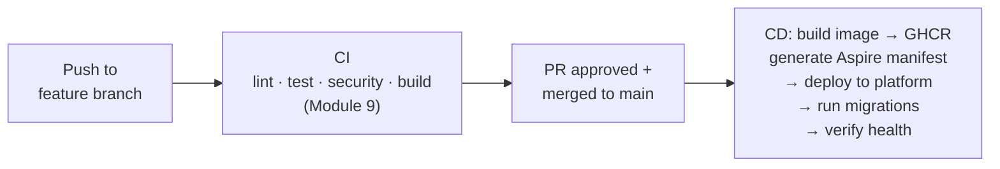
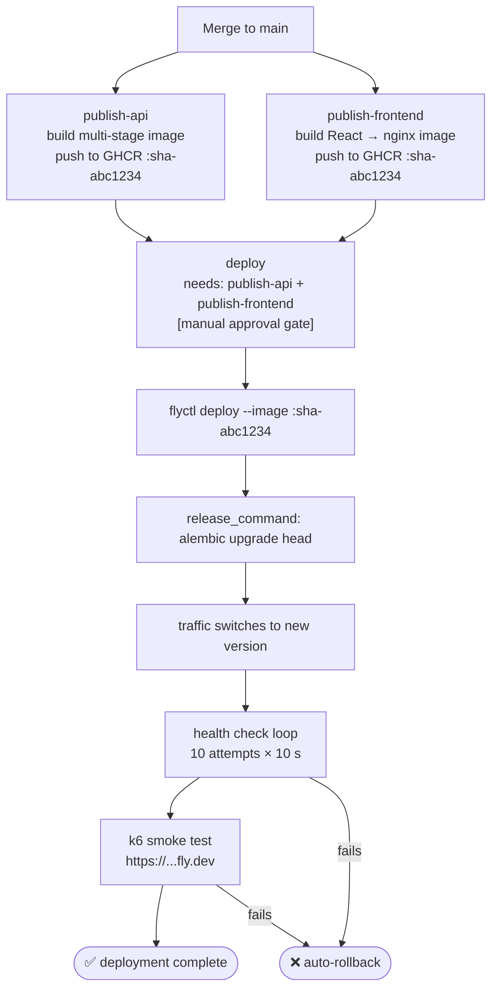
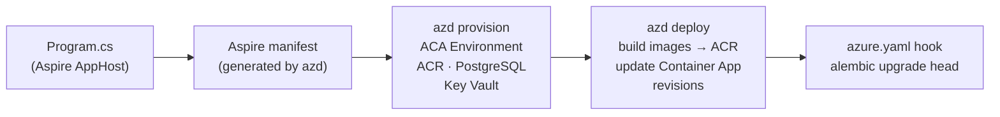

# Module 13 — Continuous Deployment

## Learning Objectives

- Understand the difference between Continuous Integration, Continuous Delivery, and Continuous Deployment
- Add `.dockerignore` files to reduce build context size and prevent accidental secret leakage
- Build production-grade multi-stage Docker images for the API and frontend
- Publish versioned Docker images to GitHub Container Registry (GHCR)
- Tag releases semantically (`v0.1.0`) so every deployment is linked to a named release
- Deploy the Task Manager to Fly.io from a GitHub Actions workflow
- Deploy to Azure Container Apps using .NET Aspire and `azd` (Aspire-native path)
- Understand how the Aspire manifest serves as the source of truth for AWS/GCP deployments
- Manage production secrets safely using platform secret stores
- Run Alembic database migrations as a step inside the deployment pipeline
- Verify a deployment with a post-deploy health check and smoke test
- Implement a one-command rollback for failed deployments
- Understand SLSA provenance and how cryptographic attestations address supply chain risk

---

## Background: CI vs CD

| Term | Meaning | When it runs |
|------|---------|-------------|
| **CI** (Continuous Integration) | Every push triggers automated quality gates (lint, test, security, build) | On every push and PR |
| **Continuous Delivery** | Every passing `main` merge produces a deployment-ready artifact; a human approves release | Merge to `main` → image published; deploy on human approval |
| **Continuous Deployment** | Every passing `main` merge deploys automatically to production | Merge to `main` → live in production within minutes |

This module implements **Continuous Delivery** by default and shows how to convert it to full Continuous Deployment.



---

## Deployment Architecture

This project supports four cloud targets. Each uses a different deployment mechanism but all share the same container images built from the same `publish.yml` workflow:

| Platform | Mechanism | Who provisions infra? | Image registry |
|----------|-----------|----------------------|----------------|
| **Fly.io** | `flyctl deploy` + `fly.toml` | Fly.io managed (flyctl postgres create) | GHCR |
| **Azure Container Apps** | `azd up` via Aspire AppHost | `azd provision` (auto — ACA, ACR, PostgreSQL, Key Vault) | ACR (built by azd) |
| **AWS ECS Fargate** | `aws/deploy.sh` + ECS task defs | Manual (VPC, ECS cluster, RDS, ALB) | GHCR |
| **GCP Cloud Run** | `infra/gcp/deploy.sh` + Cloud Run YAMLs | Manual (Cloud SQL, Secret Manager) | GHCR |

**Azure is the most complete Aspire path.** `azd` reads `azure.yaml` which points to the Aspire AppHost. `azd provision` creates all the Azure infrastructure automatically from the Aspire manifest — no manual resource creation. For AWS and GCP, the Aspire manifest is generated as a build artifact and serves as the canonical reference for what the ECS/Cloud Run configs should contain.

---

## Tools and Platform

| Tool | Purpose |
|------|---------|
| GitHub Container Registry (GHCR) | Stores versioned Docker images; free for public repos |
| .NET Aspire AppHost | Orchestrates local dev + generates deployment manifest for all cloud targets |
| `azd` (Azure Developer CLI) | Aspire-native Azure deployment: provisions infra + deploys containers |
| Fly.io | Simple deployment platform; free tier supports one app + one PostgreSQL DB |
| `flyctl` | Fly.io CLI for local commands and CI |
| `fly.toml` | Declarative app configuration (region, resources, health checks) |
| Alembic | Database migration runner (`alembic upgrade head` as a release command) |

---

## Setup

### 1. Install Fly.io CLI

```bash
brew install flyctl        # macOS
# or: curl -L https://fly.io/install.sh | sh   (Linux)
flyctl version
```

Sign up and log in:
```bash
flyctl auth signup         # or: flyctl auth login if you have an account
```

### 2. Add `.dockerignore` files

Before writing the production Dockerfiles, add `.dockerignore` files to each tier. Without them, `docker build` sends everything — including `.venv`, `node_modules`, test files, and `.git` — to the Docker daemon, inflating build context and risking accidental inclusion of secrets.

Create `backend/.dockerignore`:
```
__pycache__
*.pyc
.venv
tests/
.coverage
htmlcov/
.pytest_cache/
.mypy_cache/
.DS_Store
.env
.git
.github
docker-compose*.yml
```

Create `frontend/.dockerignore`:
```
dist/
e2e/
coverage/
node_modules/
.DS_Store
.env
.git
.github
docker-compose*.yml
```

Verify the build context is smaller after adding `.dockerignore`:
```bash
docker build --no-cache -t task-manager-api:test backend/ 2>&1 | grep "Sending build context"
```

Ask Claude Code:
> "Why does a missing `.dockerignore` in a Node.js project particularly hurt build performance? What happens if `node_modules/` is sent to the build context in a multi-stage build where the first stage runs `npm ci`?"

### 3. Upgrade the Dockerfiles for production

The starter Dockerfiles are development-grade — they install dev dependencies and run the dev server. Production needs:
- **Multi-stage builds** — compile assets in one stage, copy only the output into the final image
- **No dev dependencies** in the production image
- **Non-root user** — don't run as root inside the container
- **Static file serving** — the frontend Dockerfile should produce a static bundle served by nginx

Ask Claude Code:
> "Rewrite `backend/Dockerfile` as a two-stage build. Stage 1 (`builder`): Python 3.12-slim, install only production dependencies (no `[dev]` extras). Stage 2 (`runner`): Python 3.12-slim, copy the installed packages and app code from stage 1, create a non-root user `appuser`, run uvicorn as that user. Expose port 8000."

Then for the frontend:

> "Rewrite `frontend/Dockerfile` as a two-stage build. Stage 1 (`builder`): node:20-alpine, run `npm ci` and `npm run build`. Stage 2 (`runner`): nginx:alpine, copy the Vite build output from `/app/dist` to `/usr/share/nginx/html`, add an `nginx.conf` that handles React Router's client-side routing (all 404s → index.html). Expose port 80."

After rewriting, verify the builds work:
```bash
docker build -t task-manager-api:test backend/
docker build -t task-manager-frontend:test frontend/
docker run --rm -p 8000:8000 -e DATABASE_URL=... -e SECRET_KEY=... task-manager-api:test
```

---

## Activities

### 1. Publish images to GitHub Container Registry

GHCR stores Docker images linked to your GitHub repository. Images are tagged with the git commit SHA so every deployment is traceable.

Open `.github/workflows/publish.yml` — the workflow is already written. Read and understand the key design decisions:

```yaml
name: Publish & Deploy

on:
  push:
    branches: [main]

env:
  REGISTRY: ghcr.io
  IMAGE_NAME: ${{ github.repository }}
  IMAGE_TAG: sha-${{ github.sha }}   # long SHA — must match type=sha,format=long below

jobs:
  publish-api:
    name: Build, scan, and push API image
    permissions:
      contents: read
      packages: write            # required to push to GHCR
      security-events: write     # required for Trivy SARIF upload to Security tab

    steps:
      # ... login + checkout ...

      - name: Extract metadata
        id: meta
        uses: docker/metadata-action@v5
        with:
          images: ${{ env.REGISTRY }}/${{ env.IMAGE_NAME }}/api
          tags: |
            type=sha,format=long   # full 40-char SHA — matches IMAGE_TAG above
            type=raw,value=latest,enable=${{ github.ref == 'refs/heads/main' }}

      - name: Build and push API image
        uses: docker/build-push-action@v5
        with:
          context: backend/
          push: true
          tags: ${{ steps.meta.outputs.tags }}
          cache-from: type=gha
          cache-to: type=gha,mode=max

      - name: Scan API image for vulnerabilities (Trivy)
        uses: aquasecurity/trivy-action@0.28.0
        with:
          image-ref: ${{ env.REGISTRY }}/${{ env.IMAGE_NAME }}/api:${{ env.IMAGE_TAG }}
          severity: CRITICAL,HIGH
          exit-code: "1"   # hard gate — CRITICAL/HIGH CVE fails the job

      - name: Generate SBOM (CycloneDX JSON)
        uses: anchore/sbom-action@v0
        with:
          image: ${{ env.REGISTRY }}/${{ env.IMAGE_NAME }}/api:${{ env.IMAGE_TAG }}
          format: cyclonedx-json
          output-file: sbom-api.json
```

Key design decisions to understand:
- **`IMAGE_TAG: sha-${{ github.sha }}`** — the SHA is defined once at the workflow level and reused consistently. `type=sha,format=long` produces the same 40-char tag. If `format=short` (7 chars) were used instead, the deploy step referencing `sha-${{ github.sha }}` would fail to find the image — a silent but critical mismatch.
- **Trivy hard gate** — `exit-code: "1"` means any CRITICAL or HIGH CVE in the published image fails the job and blocks the deploy. The SARIF upload uses `if: always()` so findings appear in the Security tab even when the scan fails.
- **SBOM** — the Software Bill of Materials lists every package in the image. Required for supply chain compliance and incident response (e.g., quickly determining whether a newly disclosed CVE affects your image).

Push to `main` and verify the images appear in your GitHub repo under **Packages**.

Ask Claude Code:
> "Explain the difference between `secrets.GITHUB_TOKEN` (used above) and a personal access token. Why can we use `GITHUB_TOKEN` to push to GHCR without creating a separate secret?"

### 2. Create the Fly.io app

```bash
# Create the API app
flyctl launch --name task-manager-api --no-deploy --config fly.toml

# Create a managed PostgreSQL database on Fly.io
flyctl postgres create --name task-manager-db

# Attach the database to the app (sets DATABASE_URL automatically)
flyctl postgres attach task-manager-db --app task-manager-api
```

A `fly.toml` is already provided at the project root. Open it and replace `YOUR_GITHUB_USERNAME`:

```toml
# fly.toml — Task Manager API (production)
app = "task-manager-api"
primary_region = "sin"   # Singapore — change to your nearest: lax, ord, fra, nrt

[build]
  image = "ghcr.io/YOUR_GITHUB_USERNAME/task-manager/api:latest"

[env]
  PORT = "8000"
  ENVIRONMENT = "production"
  OTEL_ENABLED = "false"   # enable when you have an OTLP collector configured

[deploy]
  release_command = "alembic upgrade head"   # run migrations before traffic switches

[[services]]
  internal_port = 8000
  ...

  [[services.http_checks]]
    path = "/health"
```

Ask Claude Code:
> "What does the `release_command` in fly.toml do? At what point in the deployment does it run relative to traffic switching? Why is it critical that migrations run before traffic switches to the new version?"

### 3. Set production secrets

Production secrets are **never** stored in `fly.toml` or environment variables in the workflow file. They go into Fly.io's secret store, which injects them as environment variables at runtime.

```bash
# Generate a production JWT secret (different from your local .env SECRET_KEY)
SECRET_KEY=$(python3 -c "import secrets; print(secrets.token_hex(32))")

# Set secrets in Fly.io (these are encrypted at rest, not visible in logs)
flyctl secrets set \
  SECRET_KEY="$SECRET_KEY" \
  CORS_ORIGINS="https://task-manager-frontend.fly.dev" \
  --app task-manager-api

# Verify which secrets are set (values are masked)
flyctl secrets list --app task-manager-api
```

Ask Claude Code:
> "Why should the production `SECRET_KEY` be different from the one in `.env`? What would happen if an attacker obtained the production `SECRET_KEY`?"

### 4. Read and understand the CD workflow

Open `.github/workflows/publish.yml` and find the `deploy-fly-staging` and `deploy-fly-production` jobs. They are gated by `if: false` — you'll enable them in Module 16 once the Fly.io environments are configured.

The production deploy job structure (shown for reference):

```yaml
  deploy-fly-production:
    name: Promote to Fly.io production
    needs: [deploy-fly-staging]    # only runs if staging passed
    runs-on: ubuntu-latest
    environment: production        # GitHub Environment — requires manual approval

    steps:
      - uses: actions/checkout@v4

      - name: Install flyctl
        uses: superfly/flyctl-actions/setup-flyctl@master

      - name: Deploy same image to production
        run: |
          flyctl deploy \
            --app task-manager-api \
            --image ${{ env.REGISTRY }}/${{ env.IMAGE_NAME }}/api:${{ env.IMAGE_TAG }}
        env:
          FLY_API_TOKEN: ${{ secrets.FLY_API_TOKEN }}

      - name: Production health check
        run: |
          for i in $(seq 1 12); do
            STATUS=$(curl -sf -o /dev/null -w "%{http_code}" \
              "https://task-manager-api.fly.dev/health")
            echo "Attempt $i: HTTP $STATUS"
            [ "$STATUS" = "200" ] && echo "✅ Production healthy" && exit 0
            sleep 10
          done
          echo "❌ Production health check failed — rolling back"
          flyctl releases rollback --app task-manager-api
          exit 1
        env:
          FLY_API_TOKEN: ${{ secrets.FLY_API_TOKEN }}

      - name: Production smoke test
        run: |
          docker run --rm grafana/k6 run \
            -e BASE_URL=https://task-manager-api.fly.dev \
            - < load-tests/k6/smoke.js
```

Note: the `if: false` guard in publish.yml means these jobs are **disabled until you complete Module 16**. The deploy is split into staging (automatic) → production (manual approval). You're not expected to enable this now.

Add the `FLY_API_TOKEN` as a GitHub repository secret:
```bash
flyctl auth token   # copy the output
# GitHub repo → Settings → Secrets → Actions → New repository secret
# Name: FLY_API_TOKEN  Value: <token from above>
```

Ask Claude Code:
> "What is a GitHub Environment (the `environment: production` key)? How do you configure it to require a named reviewer to approve the deployment before it runs?"

### 5. Configure the GitHub Environment with manual approval

In your GitHub repo:
1. **Settings → Environments → New environment** — name it `production`
2. Enable **Required reviewers** and add yourself
3. Optionally: set a **deployment branch rule** so only `main` can deploy to production

Now the deploy job will pause at a "Review deployments" prompt. One team member must approve before Fly.io receives the deploy command.

This is **Continuous Delivery** — every `main` merge creates a deployment-ready artifact, but a human approves the final release.

To switch to full **Continuous Deployment** (no approval):
- Remove the `environment: production` line from the `deploy` job
- Now every `main` merge deploys automatically within minutes

Ask Claude Code:
> "What are the trade-offs between Continuous Delivery (with a manual approval gate) and Continuous Deployment (fully automatic)? In what situations would you prefer each?"

### 6. Database migrations in the deployment pipeline

The `release_command = "alembic upgrade head"` in `fly.toml` runs migrations before Fly.io shifts traffic to the new version. This ensures:

1. New code never runs against an old schema
2. If the migration fails, the deploy is aborted and traffic stays on the old version

There is one constraint: **migrations must be backward-compatible with the old code** until the old version is no longer running. This is called the **expand/contract pattern**:

| Phase | Migration | Safe? |
|-------|-----------|-------|
| **Expand** | Add a new nullable column | ✅ Old code ignores it |
| **Migrate data** | Backfill the new column | ✅ Old code still works |
| **Contract** | Drop the old column | ⚠️ Only safe after old version is gone |

Ask Claude Code:
> "I need to rename the column `tasks.description` to `tasks.body`. Show me the two-phase expand/contract migration strategy: Phase 1 (safe to deploy now) and Phase 2 (safe only after the old version is gone). Show the Alembic migration files for both phases."

### 7. Rollback a failed deployment

If a deployment breaks production, Fly.io keeps the previous release:

```bash
# List recent releases
flyctl releases list --app task-manager-api

# Roll back to the previous release immediately
flyctl releases rollback --app task-manager-api

# Roll back to a specific version
flyctl releases rollback v12 --app task-manager-api
```

The CD workflow's health check step already calls `flyctl releases rollback` automatically if the health check fails within 120 seconds.

Ask Claude Code:
> "What is the risk of an automatic rollback if a migration has already run? If we deployed v13 with a migration that added a new column, then rolled back to v12, what state is the database in? Is v12 code still compatible with that database state?"

### 8. Run the k6 smoke test against the live deployment

After the health check passes, run the k6 smoke test against the production URL to verify the full user journey:

Add to the `deploy` job in `publish.yml`:

```yaml
      - name: Smoke test against production
        run: |
          docker run --rm grafana/k6 run - \
            -e BASE_URL=https://task-manager-api.fly.dev \
            < load-tests/k6/smoke.js
```

You'll need to update `load-tests/k6/smoke.js` to read the `BASE_URL` from an environment variable instead of hardcoding `http://localhost:8000`:

```javascript
const BASE_URL = __ENV.BASE_URL || 'http://localhost:8000';
```

Ask Claude Code:
> "Update `load-tests/k6/smoke.js` to use `__ENV.BASE_URL` with a fallback to `http://localhost:8000`. Show only the lines that need to change."

If the smoke test fails, the deploy job exits non-zero and GitHub marks the deployment as failed — giving you a clear signal to investigate before any further changes go out.

> **DAST gate:** After the API image deploys to staging, a ZAP baseline scan can run as the next pipeline step — catching new security regressions before production promotion. See **Module 12 §10** for the exact `zaproxy/action-baseline@v0.12.0` GitHub Actions syntax and the tradeoff between passive baseline (2–5 min) and full active scan (10–30 min, destructive).

### 9. Add semantic release tagging

`sha-abc1234` image tags are great for traceability, but you also need human-readable version tags (`v0.1.0`) so you can answer "what is in production right now?" in a post-mortem.

The `publish.yml` workflow already includes a `tag-release` job that reads the version from `backend/pyproject.toml` and creates a GitHub Release if that tag doesn't yet exist. To use it:

**Step 1 — Bump the version in `backend/pyproject.toml`:**
```toml
[project]
name = "task-manager"
version = "0.2.0"   # bump this before merging a release
```

**Step 2 — Update `CHANGELOG.md`:** move items from `[Unreleased]` into a new `[0.2.0]` section.

**Step 3 — Merge to `main`.** The `tag-release` job will:
1. Read `version = "0.2.0"` from `pyproject.toml`
2. Check whether the git tag `v0.2.0` already exists
3. If not: create a GitHub Release with the title `Release v0.2.0` and a note showing which API image SHA was included

Verify in GitHub: **Code → Tags** and **Releases** — `v0.2.0` should appear linked to the commit.

Ask Claude Code:
> "The `tag-release` job reads version from `backend/pyproject.toml` but `frontend/package.json` also has a version field. Should they stay in sync? What would break if the frontend version was 0.1.0 while the API was 0.2.0?"

### 10. Understand SLSA provenance and image signing (Going Further)

**SLSA** (Supply-chain Levels for Software Artifacts, pronounced "salsa") is a framework for verifying that your build artifacts were produced by your CI system and not tampered with.

The current pipeline already covers SLSA Level 1 (provenance via SBOM + SHA-tagged images). Level 3 adds cryptographic attestations — the `slsa-provenance` job in `.github/workflows/publish.yml` implements this:

```yaml
slsa-provenance:
  needs: [publish-api, publish-frontend]
  permissions:
    id-token: write      # required for keyless signing via Sigstore
    packages: write      # required to push attestation to GHCR
  uses: slsa-framework/slsa-github-generator/.github/workflows/generator_container_slsa3.yml@v2.1.0
  with:
    image: ghcr.io/${{ github.repository }}/api
    digest: ${{ needs.publish-api.outputs.image }}
```

This signs the image with [Sigstore Cosign](https://docs.sigstore.dev/) and produces an attestation stored alongside the image in GHCR. Consumers can verify:
```bash
cosign verify-attestation --type slsaprovenance ghcr.io/your-repo/api:sha-abc1234
```

**Supply chain verification at deploy time** — the provenance is generated but never verified unless you add an explicit check. Add this step to your `deploy-fly-production` job to confirm the image you're about to ship was actually built by your GitHub Actions workflow, not a tampered image:

```bash
# Verify supply chain: image must have a valid SLSA attestation from our workflow
cosign verify \
  ghcr.io/YOUR_ORG/task-manager-api:sha-${{ github.sha }} \
  --certificate-identity-regexp "https://github.com/YOUR_REPO/.*" \
  --certificate-oidc-issuer "https://token.actions.githubusercontent.com"
```

This check fails if:
- The image was pushed outside of GitHub Actions (no attestation)
- The attestation was generated by a different repository (certificate identity mismatch)
- The signing certificate has expired (Sigstore uses ephemeral certs valid for ~10 minutes)

Ask Claude Code:
> "What is the difference between SLSA provenance and an SBOM (Software Bill of Materials)? The project already generates a CycloneDX SBOM — what additional security property does an SLSA attestation provide?"

---

## Going Further: Progressive Delivery

The current pipeline does an all-or-nothing deploy — 100% of traffic switches to the new version at once. **Progressive delivery** decouples the act of deploying a new binary from releasing it to users, reducing the blast radius of a bad deploy.

### Feature flags

Decouple deploy from release without touching the pipeline. Gate new features behind an environment variable:

```python
# backend/app/config.py
enable_comments_api: bool = Field(default=True)
```

Set `ENABLE_COMMENTS_API=false` in your secret store to hide the endpoint without a new deploy. Tools like [Unleash](https://getunleash.io/) or [LaunchDarkly](https://launchdarkly.com/) replace env vars with a managed flag service that supports percentage rollouts, A/B testing, and instant kill switches.

### Canary deployments (Fly.io native)

Route a fraction of traffic to the new version while keeping the old version live:

```toml
# fly.toml
[deploy]
  strategy = "canary"
```

Fly.io sends 10% of requests to the new revision. If health checks pass for the window, it completes the rollout. If they fail, it rolls back automatically — you never risk a full outage.

### Blue-green deployments

Keep the old revision fully live while the new revision warms up and passes smoke tests. Then switch the load balancer target atomically:

```bash
flyctl deploy --strategy bluegreen
```

No in-flight requests are dropped: the old (blue) revision continues to serve until the new (green) revision is ready and all in-flight requests complete.

Ask Claude Code:
> "Compare the risk profile of a canary deploy vs a blue-green deploy for this API. If a bad migration runs during a canary deploy, what happens to the 90% of traffic still on the old version?"

---

## Deployment Pipeline Summary



---

## Cloud Target: Azure Container Apps (Aspire-native)

Azure is the most integrated Aspire deployment path. The entire infrastructure is provisioned automatically from the Aspire manifest — no manual resource creation needed.

### How azd + Aspire works



### Quick start

```bash
# One-time setup
dotnet workload install aspire
npm install -g @azure/azd   # or: brew install azd

# Authenticate
az login
azd auth login

# First deployment (provisions infra + deploys)
azd up

# Subsequent deployments (deploy only)
azd deploy
```

`azd up` prompts for:
- **Environment name** (e.g. `task-manager-prod`) — stored in `.azure/<env>/.env`
- **Azure location** (e.g. `australiaeast`, `eastasia`)
- **Subscription** — picked from your authenticated subscriptions

It then reads `azure.yaml` → finds the Aspire AppHost → generates the manifest → provisions ACA Environment, ACR, Azure Database for PostgreSQL, and Key Vault → builds and pushes images to ACR → updates Container App revisions.

### Connect GitHub Actions

```bash
# Configures OIDC trust and writes GitHub secrets automatically:
azd pipeline config
```

This runs `az ad app create` to set up federated credentials, then writes `AZURE_CLIENT_ID`, `AZURE_TENANT_ID`, `AZURE_SUBSCRIPTION_ID` to your GitHub repository secrets. After this, the `deploy-azure` job in `publish.yml` (currently gated by `if: false`) can be enabled.

### Secrets management

Azure Key Vault is provisioned automatically. The `SECRET_KEY`, `DATABASE_URL`, and `CORS_ORIGINS` values are stored as Key Vault secrets and injected into the Container App at runtime — they never appear in `azure.yaml` or any committed file.

```bash
# View or update a secret:
azd env set SECRET_KEY "$(openssl rand -hex 32)"
azd deploy   # re-deploys with the updated secret
```

Ask Claude Code:
> "What is the difference between `azd provision` and `azd deploy`? When would you run each one separately instead of using `azd up`? What happens if you run `azd provision` on an environment that already has infrastructure?"

---

## Cloud Target: AWS ECS Fargate and GCP Cloud Run

For AWS and GCP, the Aspire AppHost still provides value even though `azd` doesn't have native publishers for these platforms.

### The Aspire manifest as source of truth

Every merge to `main` generates the Aspire manifest:

```bash
dotnet run --project aspire/TaskManager.AppHost \
  -- --publisher manifest --output-path aspire-manifest.json
```

The manifest is uploaded as a 90-day build artifact (`aspire-manifest-<sha>`). It documents:
- Every container the application needs to run
- Every environment variable each container requires
- Every parameter that differs between environments (secrets, CORS origins)
- Inter-service dependencies (`WaitFor`, endpoint references)

The ECS task definitions in `aws/ecs/` and the Cloud Run YAMLs in `infra/gcp/` should be consistent with this manifest. When you add a new env var to the Aspire AppHost, update the corresponding cloud config files to match.

Ask Claude Code:
> "Download the Aspire manifest artifact from the latest main branch workflow run. Compare the env vars listed under the `api` resource against `aws/ecs/api-task.json`. Are there any gaps?"

---

## Environment Strategy

| Environment | Trigger | Approval | Database |
|-------------|---------|----------|---------|
| Local (Aspire) | `dotnet run --project aspire/TaskManager.AppHost` | None | Local PostgreSQL (Aspire-managed) |
| Local (Docker) | `docker compose up` | None | Local PostgreSQL |
| CI | Every push | None | PostgreSQL 16 (GitHub Actions `services:` container) |
| Staging | Merge to `main` | None (auto) | Managed PostgreSQL — enabled in Module 16 |
| Production | Merge to `main` | Manual (GitHub Environment) | Managed PostgreSQL — enabled in Module 16 |

This lab starts with local + production. Module 16 adds the **staging** environment — a production-like environment that receives every `main` merge automatically, with production requiring an additional manual promotion from a named reviewer.

Ask Claude Code:
> "Design a three-environment pipeline (dev/staging/production) for this project. What would change in the GitHub Actions workflows? What would the database strategy be for staging?"

---

## Checkpoint

- [ ] `backend/.dockerignore` and `frontend/.dockerignore` committed — build context excludes `.venv`, `node_modules/`, `tests/`, `.env` (Setup 2)
- [ ] `backend/Dockerfile` is a two-stage production build with a non-root user
- [ ] `frontend/Dockerfile` is a two-stage build producing an nginx image
- [ ] Both images build successfully with `docker build`
- [ ] `.github/workflows/publish.yml` publish jobs pass on a merge to `main`
- [ ] Trivy scan passes — no CRITICAL or HIGH CVEs in either image
- [ ] Images are visible in your GitHub repo under **Packages** with `sha-<commit>` tags
- [ ] GitHub Release `v0.1.0` visible under **Code → Releases** with the correct image SHA in the notes (Activity 9)
- [ ] `CHANGELOG.md` updated — `[0.1.0]` section moved from `[Unreleased]` and dated (Activity 9)
- [ ] `fly.toml` exists at project root with `release_command = "alembic upgrade head"`
- [ ] Production `SECRET_KEY` and `CORS_ORIGINS` set via `flyctl secrets set` (not in any file)
- [ ] `FLY_API_TOKEN` is set as a GitHub repository secret
- [ ] `deploy-fly-staging` and `deploy-fly-production` jobs exist in publish.yml (gated by `if: false` until Module 16)
- [ ] Post-deploy health check and smoke test are wired; auto-rollback triggers if either fails
- [ ] Commit: `feat(cd): add production Dockerfiles, dockerignore, GHCR publish, release tagging, and Fly.io deploy pipeline`

---

## Troubleshooting

| Problem | Cause | Fix |
|---------|-------|-----|
| `flyctl deploy` fails with auth error | `FLY_API_TOKEN` not set or expired | Re-run `flyctl auth token` and update the secret |
| `alembic upgrade head` fails during deploy | Migration depends on a column the old code doesn't have | Use expand/contract — split into two deployments |
| Health check fails after deploy | App crashed at startup | `flyctl logs --app task-manager-api` to see the error |
| GHCR push denied | `packages: write` permission missing | Verify the `permissions:` block in the publish job |
| Frontend shows 404 on page refresh | nginx config missing `try_files` directive | Add `try_files $uri $uri/ /index.html;` to the nginx location block |
| Image not found during deploy | SHA tag mismatch | Confirm `type=sha,format=long` in metadata-action — `format=short` produces 7-char tags that don't match `sha-${{ github.sha }}` |
| CORS error in production | `CORS_ORIGINS` secret not set | `flyctl secrets set CORS_ORIGINS="https://your-frontend.fly.dev"` |
