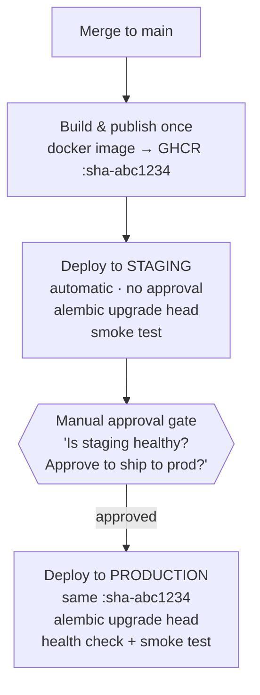

# Module 16 — Multi-Environment Strategy & Promotion Pipeline

## Learning Objectives

- Understand why a single production environment is a risk, not a simplification
- Design a `staging → production` promotion pipeline using GitHub Environments
- Deploy the **same versioned image** to staging and then to production — never rebuild between environments
- Inject environment-specific configuration without changing application code
- Gate production promotion on staging health checks and smoke tests
- Understand the expand/contract pattern for zero-downtime database migrations across environments
- Appreciate what blue-green deployment buys you over a simple in-place rollout

---

## Background

### Why multiple environments?

| Risk with single-environment deploy | Multi-environment mitigation |
|-------------------------------------|------------------------------|
| A regression ships directly to users | Staging catches it before production promotion |
| Schema migrations cannot be tested before prod | Staging runs migrations against a production-like database first |
| Secrets for dev accidentally used in prod | Each environment has its own secret store — values never cross boundaries |
| "Works on my machine" but fails in the cloud | Staging must match production infrastructure exactly |

### The same-artifact principle

The most important rule of a promotion pipeline: **the artifact deployed to staging is the same binary deployed to production.** You do not rebuild, re-test, or recompile between environments.



### GitHub Environments

A GitHub Environment is a named deployment context with:
- **Protection rules** — who can approve a deployment to this environment
- **Deployment branch rules** — only `main` can deploy to `production`
- **Environment secrets** — secrets scoped to this environment only (override repository secrets)
- **Environment variables** — non-secret config values specific to this environment

---

## Prerequisites

- Module 13 completed: `publish.yml` builds and pushes images to GHCR
- At least one cloud deployment working (Fly.io, Cloud Run, ECS, or Container Apps)
- The `publish.yml` CD workflow has `needs: [publish-api, publish-frontend]` before the deploy job

---

## Activities

### 1. Create the GitHub Environments

In your GitHub repository:

1. Go to **Settings → Environments → New environment**
2. Create `staging`:
   - No required reviewers (auto-approves)
   - Deployment branches: `main` only
3. Create `production`:
   - Add yourself (or a team lead) as a **required reviewer**
   - Deployment branches: `main` only
   - Optionally enable a **wait timer** (e.g., 10 minutes) to give staging time to warm up

Ask Claude Code:
> "What is the security value of environment protection rules in GitHub beyond just slowing down deployments? What attack would they prevent?"

---

### 2. Create environment-specific secrets

Each environment needs its own set of secrets. Values should **never be shared** between staging and production.

**In GitHub → Settings → Environments → staging → Environment secrets:**

| Secret | Staging value |
|--------|--------------|
| `SECRET_KEY` | Generate: `python3 -c "import secrets; print(secrets.token_hex(32))"` |
| `DATABASE_URL` | Your staging database connection string |
| `FLY_API_TOKEN` (or cloud equivalent) | Same token, but staging app name |

**In GitHub → Settings → Environments → production → Environment secrets:**

| Secret | Production value |
|--------|----------------|
| `SECRET_KEY` | A different generated value — never the same as staging |
| `DATABASE_URL` | Your production database connection string |
| `FLY_API_TOKEN` | Same token, but production app name |

**Environment variables (non-secret, visible in logs):**

| Variable | Staging | Production |
|----------|---------|-----------|
| `APP_NAME` | `task-manager-staging` | `task-manager-api` |
| `ENVIRONMENT` | `staging` | `production` |
| `CORS_ORIGINS` | `https://staging.yourdomain.com` | `https://yourdomain.com` |
| `VITE_API_URL` | Staging API URL | Production API URL |

Ask Claude Code:
> "Read `backend/app/config.py`. Which settings should vary between staging and production? Are there any that are currently hardcoded that should be environment-driven?"

---

### 3. Create the staging deployment target

If you are using Fly.io (the default from Module 13), create a separate staging app:

```bash
# Create a staging app (separate from task-manager-api)
flyctl launch --name task-manager-staging --no-deploy --copy-config

# Create a staging PostgreSQL database
flyctl postgres create --name task-manager-staging-db

# Attach staging DB to the staging app
flyctl postgres attach task-manager-staging-db --app task-manager-staging

# Set staging-specific secrets (different SECRET_KEY from production)
STAGING_SECRET=$(python3 -c "import secrets; print(secrets.token_hex(32))")
flyctl secrets set SECRET_KEY="$STAGING_SECRET" ENVIRONMENT="staging" \
  --app task-manager-staging
```

For other cloud targets, create an equivalent staging service:
- **Cloud Run:** `gcloud run services create task-manager-staging ...`
- **ECS Fargate:** duplicate the task definition with a `-staging` suffix
- **Azure Container Apps:** create a second container app in the same resource group

---

### 4. Rewrite `publish.yml` with the promotion pipeline

Replace the single `deploy` job with three stages: build (existing) → deploy-staging → deploy-production.

```yaml
# .github/workflows/publish.yml

name: Publish & Promote

on:
  push:
    branches: [main]

env:
  REGISTRY: ghcr.io
  IMAGE_NAME: ${{ github.repository }}
  IMAGE_TAG: sha-${{ github.sha }}

jobs:
  # ── 1. Build and publish images (unchanged from Module 13) ──────────────────
  publish-api:
    name: Build and push API image
    runs-on: ubuntu-latest
    permissions:
      contents: read
      packages: write
    outputs:
      image: ${{ env.REGISTRY }}/${{ env.IMAGE_NAME }}/api:${{ env.IMAGE_TAG }}
    steps:
      - uses: actions/checkout@v4
      - uses: docker/login-action@v3
        with:
          registry: ${{ env.REGISTRY }}
          username: ${{ github.actor }}
          password: ${{ secrets.GITHUB_TOKEN }}
      - uses: docker/metadata-action@v5
        id: meta
        with:
          images: ${{ env.REGISTRY }}/${{ env.IMAGE_NAME }}/api
          tags: |
            type=sha,format=long
            type=raw,value=latest
      - uses: docker/build-push-action@v5
        with:
          context: backend/
          push: true
          tags: ${{ steps.meta.outputs.tags }}
          cache-from: type=gha
          cache-to: type=gha,mode=max

  # ── 2. Deploy to staging (automatic, no approval) ───────────────────────────
  deploy-staging:
    name: Deploy to staging
    needs: [publish-api]
    runs-on: ubuntu-latest
    environment: staging           # uses staging secrets; no required reviewers

    steps:
      - uses: actions/checkout@v4

      - name: Install flyctl
        uses: superfly/flyctl-actions/setup-flyctl@master

      - name: Deploy API to staging
        run: |
          flyctl deploy \
            --app task-manager-staging \
            --image ${{ env.REGISTRY }}/${{ env.IMAGE_NAME }}/api:${{ env.IMAGE_TAG }}
        env:
          FLY_API_TOKEN: ${{ secrets.FLY_API_TOKEN }}

      - name: Wait for health check
        run: |
          STAGING_URL="https://task-manager-staging.fly.dev"
          for i in $(seq 1 12); do
            STATUS=$(curl -sf -o /dev/null -w "%{http_code}" "$STAGING_URL/health")
            echo "Attempt $i: HTTP $STATUS"
            [ "$STATUS" = "200" ] && echo "✅ Staging health check passed" && exit 0
            sleep 10
          done
          echo "❌ Staging health check failed — blocking production promotion"
          exit 1
        env:
          FLY_API_TOKEN: ${{ secrets.FLY_API_TOKEN }}

      - name: Run smoke test against staging
        run: |
          docker run --rm grafana/k6 run \
            -e BASE_URL=https://task-manager-staging.fly.dev \
            - < load-tests/k6/smoke.js

  # ── 3. Promote to production (manual approval required) ─────────────────────
  deploy-production:
    name: Promote to production
    needs: [deploy-staging]        # only runs if staging succeeded
    runs-on: ubuntu-latest
    environment: production        # requires a human reviewer to approve

    steps:
      - uses: actions/checkout@v4

      - name: Install flyctl
        uses: superfly/flyctl-actions/setup-flyctl@master

      - name: Deploy same image to production
        run: |
          flyctl deploy \
            --app task-manager-api \
            --image ${{ env.REGISTRY }}/${{ env.IMAGE_NAME }}/api:${{ env.IMAGE_TAG }}
        env:
          FLY_API_TOKEN: ${{ secrets.FLY_API_TOKEN }}

      - name: Production health check
        run: |
          for i in $(seq 1 12); do
            STATUS=$(curl -sf -o /dev/null -w "%{http_code}" \
              "https://task-manager-api.fly.dev/health")
            echo "Attempt $i: HTTP $STATUS"
            [ "$STATUS" = "200" ] && echo "✅ Production health check passed" && exit 0
            sleep 10
          done
          echo "❌ Production health check failed — rolling back"
          flyctl releases rollback --app task-manager-api
          exit 1
        env:
          FLY_API_TOKEN: ${{ secrets.FLY_API_TOKEN }}

      - name: Production smoke test
        run: |
          docker run --rm grafana/k6 run \
            -e BASE_URL=https://task-manager-api.fly.dev \
            - < load-tests/k6/smoke.js
```

Push to `main` and watch the Actions tab. The `deploy-staging` job runs automatically. When it succeeds, GitHub pauses at `deploy-production` with a **"Review deployments"** button — the named reviewer must approve before production receives the deployment.

Ask Claude Code:
> "In the workflow above, `deploy-production` has `needs: [deploy-staging]`. What happens if the staging smoke test fails? Does production ever get deployed? Walk through the GitHub Actions dependency graph."

---

### 5. Environment-specific application configuration

The application reads configuration from environment variables (via `backend/app/config.py`). Each GitHub Environment injects different values without changing any application code.

Verify the pattern works end-to-end:

```bash
# Check which environment the staging app is running as
curl -s https://task-manager-staging.fly.dev/health | python3 -m json.tool
# Should include "environment": "staging" in the response body

curl -s https://task-manager-api.fly.dev/health | python3 -m json.tool
# Should include "environment": "production"
```

If `/health` does not return the environment name, add it:

```python
# backend/app/routers/health.py (or wherever /health is defined)
from app.config import settings

@router.get("/health")
async def health():
    return {"status": "ok", "environment": settings.environment}
```

Ask Claude Code:
> "Look at `backend/app/config.py`. Are there any settings that should differ between staging and production but are currently identical? What are the risks of staging and production sharing the same `SECRET_KEY`?"

---

### 6. Database migrations across environments

Migrations must run on the staging database **before** the staging deploy receives traffic, and on the production database **before** production receives traffic. This is already handled by `release_command = "alembic upgrade head"` in `fly.toml`.

The additional constraint in a multi-environment pipeline: **every migration must be backward-compatible with the version currently running in production.**

#### The expand/contract pattern in practice

Scenario: you need to rename `tasks.description` to `tasks.body`.

**Phase 1 — Expand (safe to deploy to staging and production immediately):**

```python
# alembic/versions/003_expand_add_body_column.py
def upgrade():
    op.add_column("tasks", sa.Column("body", sa.Text(), nullable=True))
    # Copy existing data
    op.execute("UPDATE tasks SET body = description")
    # Make new column non-nullable
    op.alter_column("tasks", "body", nullable=False)
    # Do NOT drop 'description' yet — the current production code still reads it
```

**Phase 2 — Update code** (deploy to staging, verify, promote to production):

```python
# In all queries and schemas, read from 'body' instead of 'description'
# The old 'description' column still exists in the DB — both old and new code work
```

**Phase 3 — Contract (only after Phase 2 is in production):**

```python
# alembic/versions/004_contract_drop_description_column.py
def upgrade():
    op.drop_column("tasks", "description")
    # Now safe — no deployed code reads this column
```

Ask Claude Code:
> "I need to add a NOT NULL foreign key column to the tasks table that references a new `labels` table. There are 50,000 existing rows with no label. Walk me through the expand/contract steps. Where does each step deploy? What would break if I tried to do it in a single migration?"

---

### 7. Blue-green deployment

In a blue-green deployment, two identical production environments ("blue" and "green") run simultaneously. Traffic is routed to one (the active version). The new version deploys to the inactive one. After health checks pass, the load balancer switches traffic instantly. The old version stays up for an immediate rollback window.

```
Before deploy:          After deploy:           After rollback window:
                                                
BLUE  (v12) ◄── 100%   BLUE  (v12) ◄── 0%     BLUE  (v12) terminate
GREEN (v13) ◄── 0%     GREEN (v13) ◄── 100%   GREEN (v13) ◄── 100%
```

Fly.io implements this automatically via its rolling deploy strategy. The migration `release_command` ensures the new schema is live before the traffic switch.

For explicit blue-green control on other platforms:

```bash
# Cloud Run blue-green with traffic splitting
gcloud run services update-traffic task-manager-api \
  --to-revisions LATEST=10,STABLE=90   # send 10% to new version first
# Verify: no error spike
gcloud run services update-traffic task-manager-api \
  --to-revisions LATEST=100            # promote to 100%
```

Ask Claude Code:
> "What is the difference between a blue-green deployment and a canary release? Which is more appropriate for the Task Manager? When would you choose the other?"

---

## Environment matrix

After completing this module, your environment strategy should look like this:

| Environment | Trigger | Approval | Database | Config source | Purpose |
|-------------|---------|----------|----------|---------------|---------|
| Local | `docker compose up` | None | Local PostgreSQL | `.env` file | Development |
| CI | Every push | None | Same local DB (via `ENVIRONMENT=test`) | CI env vars | Quality gates |
| Staging | Merge to `main` | None (auto) | Staging managed DB | GitHub Environment: staging | Pre-production verification |
| Production | Staging passes | Human approval | Production managed DB | GitHub Environment: production | Live users |

---

## Checkpoint

- [ ] `staging` GitHub Environment created — no required reviewers, `main` branch only
- [ ] `production` GitHub Environment created — named reviewer required, `main` branch only
- [ ] Staging Fly.io app created with its own PostgreSQL database
- [ ] Staging and production each have separate `SECRET_KEY` values (never shared)
- [ ] `publish.yml` has three jobs: `publish-api` → `deploy-staging` → `deploy-production`
- [ ] `deploy-production` has `needs: [deploy-staging]` — it cannot run if staging fails
- [ ] Merge to `main` triggers automatic staging deploy; production pauses for approval
- [ ] `/health` returns the correct `environment` value for each deployment target
- [ ] Expand/contract migration pattern understood — can explain the three phases
- [ ] Commit: `feat(pipeline): add staging environment and multi-step promotion pipeline`

---

## Troubleshooting

| Problem | Cause | Fix |
|---------|-------|-----|
| `deploy-production` runs without approval | `environment:` key missing or environment not configured | Add `environment: production` to the job and configure required reviewers in GitHub Settings |
| Staging deploy uses production secrets | Secrets not set at environment level | Ensure secrets are in the environment settings, not repository settings — environment secrets override repository secrets |
| Smoke test fails on staging but works locally | `BASE_URL` env var not passed to k6 | Confirm `__ENV.BASE_URL` is used in `smoke.js` with a localhost fallback |
| Migration fails on staging DB but not locally | Staging DB has different existing data or schema | Check `alembic history` on staging; run migration in dry-run mode first |
| Production not gated behind staging | `needs:` key missing | `deploy-production` must list `deploy-staging` in its `needs:` array |
