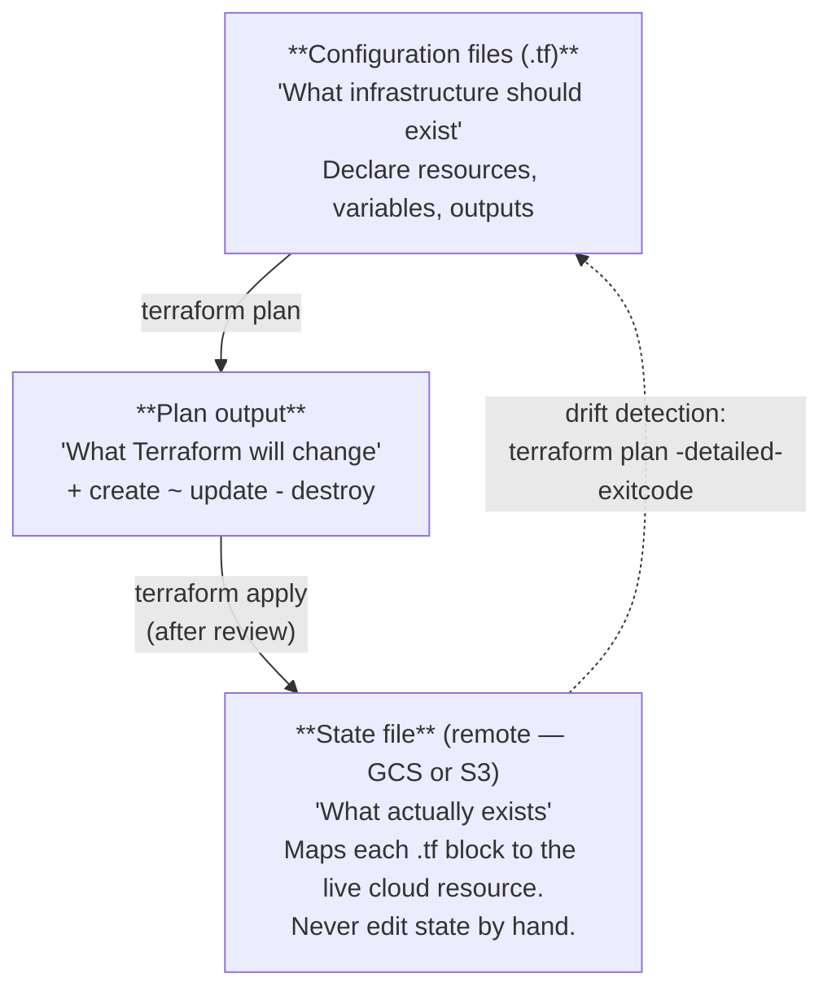

# Module 17 — Infrastructure as Code (Terraform)

## Learning Objectives

- Understand why Infrastructure as Code is a prerequisite for enterprise cloud operations
- Write Terraform configuration for a complete cloud-deployed application (compute + database + networking)
- Manage Terraform remote state safely so a team can share infrastructure without conflicts
- Run `terraform plan` in CI (read-only, on every PR) and `terraform apply` in CD (on merge to main)
- Tag all resources for cost attribution and compliance reporting
- Detect and respond to infrastructure drift — when reality diverges from the Terraform definition
- Understand the trade-off between Terraform and platform-specific tools (CDK, Bicep, Pulumi)

---

## Background

### Why not bash deploy scripts?

Module 13 uses `aws/deploy.sh` and `infra/gcp/deploy.sh` to deploy infrastructure. These scripts work for a single developer on a single machine, but they break down in teams:

| Problem | Bash scripts | Terraform |
|---------|-------------|-----------|
| Idempotency | Re-running may create duplicates | Plan/apply is always idempotent |
| Visibility | Nobody knows what is in production | State file is the authoritative record |
| Peer review | Hard to diff shell commands | `terraform plan` output is reviewable |
| Rollback | Manual, error-prone | State-based rollback or workspace swap |
| Drift detection | None | `terraform plan` shows what changed |
| Auditability | Logs only if you remember to add them | Every apply is versioned in state |

### Terraform core concepts



### The .NET Aspire manifest as deployment IaC

Before reaching for Terraform, understand what the Aspire manifest already provides.

The Aspire AppHost (`aspire/TaskManager.AppHost/Program.cs`) is a C# program that declares the full application topology — services, databases, environment variables, secrets, and service-to-service wiring. Generate the deployment manifest:

```bash
dotnet run --project aspire/TaskManager.AppHost \
  -- --publisher manifest --output-path aspire-manifest.json
```

The manifest is the single source of truth for:
- What containers to run and from which images
- What environment variables each container receives (including secret references)
- How services reference each other (e.g., frontend's `VITE_API_URL` = API's endpoint)
- What parameters differ between environments

For **Azure**, `azd` reads this manifest natively — no Terraform needed. `azd provision` creates the Container Apps Environment, ACR, PostgreSQL Flexible Server, and Key Vault. `azd deploy` builds and pushes images, updates revisions, and runs the post-deploy migration hook.

For **AWS and GCP**, the manifest serves as the reference spec. The ECS task definitions and Cloud Run YAMLs should mirror what the manifest describes. When you add a new env var in `Program.cs`, update the cloud configs to match.

**When the Aspire manifest is enough**: Azure-first deployments, teams on the Microsoft/.NET ecosystem, projects where `azd up` covers the infrastructure complexity.

**When you need Terraform**: Multi-cloud teams, infrastructure shared by multiple applications, teams with existing Terraform state and modules, or when you need precise control over networking, IAM, and billing tags.

### Tool choice

This module uses **Terraform** (or its open-source fork **OpenTofu**). The patterns are identical — swap `terraform` for `tofu` if you prefer the OSS route.

**Alternatives and when to use them:**

| Tool | Best for | Avoid when |
|------|---------|-----------|
| .NET Aspire + azd | Azure Container Apps; application topology as code | Multi-cloud or existing Terraform state |
| Terraform / OpenTofu | Multi-cloud, team of 2+ | Rapid solo prototyping |
| AWS CDK | AWS-only, prefer TypeScript/Python | You need to support Azure or GCP |
| Azure Bicep | Azure-only, Microsoft ecosystem | Multi-cloud |
| Pulumi | Developers who want general-purpose language | Team unfamiliar with async loops in IaC |

---

## Prerequisites

- Module 13 completed: images are published to GHCR
- Module 16 completed: staging and production environments exist
- A GCP project (primary example) **or** AWS account **or** Azure subscription
- The relevant CLI installed and authenticated

---

## Setup

### 1. Install Terraform (or OpenTofu)

```bash
# macOS
brew tap hashicorp/tap && brew install hashicorp/tap/terraform
# or OpenTofu (open-source fork)
brew install opentofu

# Verify
terraform version    # or: tofu version
# Expected: Terraform v1.9+ (or OpenTofu v1.8+)
```

### 2. Create the Terraform directory structure

```bash
mkdir -p infra/terraform/{modules/cloud-run,environments/{staging,production}}
```

Resulting layout:

```
infra/terraform/
├── modules/
│   └── cloud-run/           # reusable module: Cloud Run service + Cloud SQL
│       ├── main.tf
│       ├── variables.tf
│       └── outputs.tf
└── environments/
    ├── staging/             # staging-specific values
    │   ├── main.tf
    │   ├── terraform.tfvars
    │   └── backend.tf
    └── production/          # production-specific values
        ├── main.tf
        ├── terraform.tfvars
        └── backend.tf
```

---

## Activities

### 1. Configure remote state

Terraform state must be stored remotely so the team shares one view of infrastructure. Never use local state in a team setting — it leads to conflicts and accidental destruction of resources.

**Create the GCS bucket for state (one-time, done manually):**

```bash
# Replace PROJECT_ID and REGION with your values
export PROJECT_ID=your-gcp-project-id
export REGION=asia-southeast1

gcloud storage buckets create gs://${PROJECT_ID}-terraform-state \
  --location=${REGION} \
  --uniform-bucket-level-access \
  --versioning

# Enable versioning so you can recover from accidental state corruption
gcloud storage buckets update gs://${PROJECT_ID}-terraform-state \
  --versioning
```

**Create `infra/terraform/environments/staging/backend.tf`:**

```hcl
terraform {
  required_version = ">= 1.9"

  required_providers {
    google = {
      source  = "hashicorp/google"
      version = "~> 5.0"
    }
  }

  backend "gcs" {
    bucket = "YOUR_PROJECT_ID-terraform-state"
    prefix = "task-manager/staging"
    # State stored at: gs://PROJECT_ID-terraform-state/task-manager/staging/default.tfstate
  }
}
```

**Create `infra/terraform/environments/production/backend.tf`:**

```hcl
terraform {
  required_version = ">= 1.9"

  required_providers {
    google = {
      source  = "hashicorp/google"
      version = "~> 5.0"
    }
  }

  backend "gcs" {
    bucket = "YOUR_PROJECT_ID-terraform-state"
    prefix = "task-manager/production"
    # Separate state file from staging — they never share state
  }
}
```

Ask Claude Code:
> "Why does each environment have its own Terraform state file? What would happen if staging and production shared the same state file?"

---

### 2. Write the reusable `cloud-run` module

A Terraform module is a reusable unit of configuration. The `cloud-run` module encapsulates a Cloud Run service and a Cloud SQL instance, which are the same for both staging and production — only the values differ.

**`infra/terraform/modules/cloud-run/variables.tf`:**

```hcl
variable "project_id" {
  type        = string
  description = "GCP project ID"
}

variable "region" {
  type        = string
  description = "GCP region for all resources"
}

variable "environment" {
  type        = string
  description = "Environment name: staging or production"
  validation {
    condition     = contains(["staging", "production"], var.environment)
    error_message = "Must be 'staging' or 'production'."
  }
}

variable "image_tag" {
  type        = string
  description = "Docker image tag to deploy (e.g. sha-abc1234)"
}

variable "github_repository" {
  type        = string
  description = "GitHub repository in 'owner/repo' format"
}

variable "secret_key" {
  type        = string
  sensitive   = true
  description = "JWT signing key — injected from Secret Manager, never in state"
}

variable "db_tier" {
  type        = string
  default     = "db-f1-micro"
  description = "Cloud SQL machine tier. Use db-f1-micro for staging, db-n1-standard-1 for production."
}

variable "min_instances" {
  type        = number
  default     = 0
  description = "Minimum Cloud Run instances. 0 = scale to zero (staging). 1+ = always-on (production)."
}

variable "max_instances" {
  type        = number
  default     = 10
  description = "Maximum Cloud Run instances for autoscaling."
}
```

**`infra/terraform/modules/cloud-run/main.tf`:**

```hcl
locals {
  name_prefix = "task-manager-${var.environment}"
  image        = "ghcr.io/${var.github_repository}/api:${var.image_tag}"

  # Resource tags applied to every resource for cost attribution
  labels = {
    app         = "task-manager"
    environment = var.environment
    managed_by  = "terraform"
    team        = "platform"
  }
}

# ── Cloud SQL (PostgreSQL 16) ──────────────────────────────────────────────────
resource "google_sql_database_instance" "main" {
  name             = "${local.name_prefix}-db"
  database_version = "POSTGRES_16"
  region           = var.region
  deletion_protection = var.environment == "production" ? true : false

  settings {
    tier = var.db_tier

    backup_configuration {
      enabled                        = true
      point_in_time_recovery_enabled = var.environment == "production"
      backup_retention_settings {
        retained_backups = var.environment == "production" ? 30 : 7
      }
    }

    maintenance_window {
      day  = 7  # Sunday
      hour = 3  # 03:00 UTC — low traffic window
    }

    database_flags {
      name  = "log_min_duration_statement"
      value = "1000"  # log queries taking > 1 s
    }

    user_labels = local.labels
  }
}

resource "google_sql_database" "taskmanager" {
  name     = "taskmanager"
  instance = google_sql_database_instance.main.name
}

resource "google_sql_user" "taskuser" {
  name     = "taskuser"
  instance = google_sql_database_instance.main.name
  password = random_password.db_password.result
}

resource "random_password" "db_password" {
  length  = 32
  special = true
}

# Store the connection string in Secret Manager (never in state as plaintext)
resource "google_secret_manager_secret" "database_url" {
  secret_id = "${local.name_prefix}-database-url"
  replication { auto {} }
  labels = local.labels
}

resource "google_secret_manager_secret_version" "database_url" {
  secret = google_secret_manager_secret.database_url.id
  secret_data = format(
    "postgresql+asyncpg://taskuser:%s@/%s?host=/cloudsql/%s",
    random_password.db_password.result,
    google_sql_database.taskmanager.name,
    google_sql_database_instance.main.connection_name
  )
}

# ── Service Account for Cloud Run ─────────────────────────────────────────────
resource "google_service_account" "api" {
  account_id   = "${local.name_prefix}-api"
  display_name = "Task Manager API — ${var.environment}"
}

resource "google_secret_manager_secret_iam_member" "api_database_url" {
  secret_id = google_secret_manager_secret.database_url.id
  role      = "roles/secretmanager.secretAccessor"
  member    = "serviceAccount:${google_service_account.api.email}"
}

# ── Cloud Run Service ─────────────────────────────────────────────────────────
resource "google_cloud_run_v2_service" "api" {
  name     = "${local.name_prefix}-api"
  location = var.region
  labels   = local.labels

  template {
    service_account = google_service_account.api.email

    scaling {
      min_instance_count = var.min_instances
      max_instance_count = var.max_instances
    }

    volumes {
      name = "cloudsql"
      cloud_sql_instance {
        instances = [google_sql_database_instance.main.connection_name]
      }
    }

    containers {
      image = local.image

      volume_mounts {
        name       = "cloudsql"
        mount_path = "/cloudsql"
      }

      env {
        name  = "ENVIRONMENT"
        value = var.environment
      }
      env {
        name  = "OTEL_ENABLED"
        value = "false"
      }
      env {
        name = "DATABASE_URL"
        value_source {
          secret_key_ref {
            secret  = google_secret_manager_secret.database_url.secret_id
            version = "latest"
          }
        }
      }
      env {
        name = "SECRET_KEY"
        value_source {
          secret_key_ref {
            secret  = google_secret_manager_secret.secret_key.secret_id
            version = "latest"
          }
        }
      }

      resources {
        limits = {
          cpu    = var.environment == "production" ? "2" : "1"
          memory = var.environment == "production" ? "1Gi" : "512Mi"
        }
      }

      startup_probe {
        http_get { path = "/health" }
        initial_delay_seconds = 10
        period_seconds        = 5
        failure_threshold     = 6
      }

      liveness_probe {
        http_get { path = "/ready" }
        period_seconds    = 30
        failure_threshold = 3
      }
    }
  }
}

resource "google_secret_manager_secret" "secret_key" {
  secret_id = "${local.name_prefix}-secret-key"
  replication { auto {} }
  labels = local.labels
}

resource "google_secret_manager_secret_version" "secret_key" {
  secret      = google_secret_manager_secret.secret_key.id
  secret_data = var.secret_key
}

# Allow unauthenticated access (the app handles its own auth via JWT)
resource "google_cloud_run_v2_service_iam_member" "public" {
  name     = google_cloud_run_v2_service.api.name
  location = var.region
  role     = "roles/run.invoker"
  member   = "allUsers"
}
```

**`infra/terraform/modules/cloud-run/outputs.tf`:**

```hcl
output "api_url" {
  value       = google_cloud_run_v2_service.api.uri
  description = "The deployed API URL"
}

output "db_connection_name" {
  value       = google_sql_database_instance.main.connection_name
  description = "Cloud SQL connection name for the Cloud SQL Auth Proxy"
}

output "service_account_email" {
  value       = google_service_account.api.email
  description = "Service account email for the Cloud Run service"
}
```

Ask Claude Code:
> "In `main.tf`, the `secret_key` variable is marked `sensitive = true`. What does this do in Terraform? Does it prevent the value from being stored in the state file? If not, how should you handle truly sensitive values in Terraform state?"

---

### 3. Write environment-specific configurations

**`infra/terraform/environments/staging/main.tf`:**

```hcl
provider "google" {
  project = var.project_id
  region  = var.region
}

module "task_manager" {
  source = "../../modules/cloud-run"

  project_id        = var.project_id
  region            = var.region
  environment       = "staging"
  image_tag         = var.image_tag
  github_repository = var.github_repository
  secret_key        = var.secret_key

  # Staging: scale to zero to minimise costs
  db_tier       = "db-f1-micro"
  min_instances = 0
  max_instances = 5
}

output "staging_api_url" {
  value = module.task_manager.api_url
}
```

**`infra/terraform/environments/staging/terraform.tfvars`:**

```hcl
# Non-secret values only — committed to git
project_id        = "your-gcp-project-id"
region            = "asia-southeast1"
github_repository = "your-github-username/task-manager"
# image_tag is injected by CI — not hardcoded here
# secret_key is injected from CI secrets — never in this file
```

**`infra/terraform/environments/production/main.tf`:**

```hcl
provider "google" {
  project = var.project_id
  region  = var.region
}

module "task_manager" {
  source = "../../modules/cloud-run"

  project_id        = var.project_id
  region            = var.region
  environment       = "production"
  image_tag         = var.image_tag
  github_repository = var.github_repository
  secret_key        = var.secret_key

  # Production: always-on, higher capacity
  db_tier       = "db-n1-standard-1"
  min_instances = 1
  max_instances = 20
}

output "production_api_url" {
  value = module.task_manager.api_url
}
```

Add `infra/terraform/environments/*/terraform.tfvars` to `.gitignore` if it contains sensitive values. Secret values (`secret_key`) must **never** appear in any committed file.

Ask Claude Code:
> "What is the difference between `terraform.tfvars` and environment variables for passing values to Terraform? When would you use each? Which approach is better for secrets injected from CI?"

---

### 4. Run Terraform locally

```bash
cd infra/terraform/environments/staging

# Download providers and initialize the backend
terraform init

# Preview what Terraform would create (no changes made)
terraform plan \
  -var="image_tag=sha-$(git rev-parse --short HEAD)" \
  -var="secret_key=${STAGING_SECRET_KEY}"

# Review the plan output carefully:
# '+' = create   '~' = update in place   '-' = destroy
# Never approve a plan you haven't fully read

# Scan Terraform config for security misconfigurations before applying
docker run --rm \
  -v "$(pwd)/../../..:/src" \
  aquasec/tfsec /src/infra/terraform

# Apply the plan (creates real cloud resources)
terraform apply \
  -var="image_tag=sha-$(git rev-parse --short HEAD)" \
  -var="secret_key=${STAGING_SECRET_KEY}"
```

**What tfsec checks:** tfsec scans your Terraform HCL for misconfigurations before any cloud resources are created. Common findings for this module's config:

| Finding | Severity | Default stance | Production fix |
|---------|----------|---------------|---------------|
| Cloud SQL instance publicly accessible | HIGH | Lab only — private IP requires a VPC connector | Add `ip_configuration { ipv4_enabled = false }` |
| GCS state bucket without object versioning lock | MEDIUM | Versioning is on; lock is extra | `google_storage_bucket.versioning.enabled = true` already set |
| Cloud Run service allows unauthenticated invokers | MEDIUM | Accepted — app handles JWT auth | Add suppression comment: `#tfsec:ignore:google-cloud-run-no-unauthenticated` |
| No VPC for Cloud SQL private access | LOW | Lab trade-off (VPC adds 20+ minutes) | Use private IP + VPC connector in production |

For lab purposes, run tfsec to understand the findings, then add targeted suppression comments for accepted risks rather than fixing every finding. A suppression without a justification comment is just noise — always add the reason:

```hcl
# Allow unauthenticated access — the app enforces JWT auth, not Cloud Run IAM
#tfsec:ignore:google-cloud-run-no-unauthenticated
resource "google_cloud_run_v2_service_iam_member" "public" {
```

Ask Claude Code:
> "Run tfsec against `infra/terraform/` and explain each finding. For each one, decide: is this a real production risk that needs fixing, or an acceptable lab trade-off that should be suppressed with a justification comment?"

After apply, test the deployed service:

```bash
STAGING_URL=$(terraform output -raw staging_api_url)
curl -s "${STAGING_URL}/health" | python3 -m json.tool
```

Ask Claude Code:
> "Read the `terraform plan` output. For each resource marked for creation, explain what it is and why it is needed. Are there any resources being created that surprise you?"

---

### 5. Integrate Terraform into the CI/CD pipeline

Add Terraform plan to the PR workflow (read-only — never applies on a PR):

**In `.github/workflows/ci.yml`, add a new job:**

```yaml
  terraform-plan:
    name: Terraform plan (staging)
    runs-on: ubuntu-latest
    permissions:
      contents: read
      pull-requests: write    # to post the plan as a PR comment
    if: github.event_name == 'pull_request'

    steps:
      - uses: actions/checkout@v4

      - name: Authenticate to GCP
        uses: google-github-actions/auth@v2
        with:
          workload_identity_provider: ${{ secrets.GCP_WORKLOAD_IDENTITY_PROVIDER }}
          service_account: ${{ secrets.GCP_SERVICE_ACCOUNT }}

      - uses: hashicorp/setup-terraform@v3
        with:
          terraform_version: "1.9"

      - name: Terraform init
        run: terraform init
        working-directory: infra/terraform/environments/staging

      - name: Terraform plan
        id: plan
        run: |
          terraform plan -no-color \
            -var="image_tag=sha-${{ github.sha }}" \
            -var="secret_key=placeholder"    # plan only — not applying
        working-directory: infra/terraform/environments/staging

      - name: tfsec IaC security scan
        uses: aquasec/tfsec-action@v1.0.0
        with:
          working_directory: infra/terraform
          soft_fail: true    # warn without blocking; set to false to hard-gate

      - name: Post plan as PR comment
        uses: actions/github-script@v7
        with:
          script: |
            const output = `#### Terraform Plan — Staging
            \`\`\`
            ${{ steps.plan.outputs.stdout }}
            \`\`\``;
            github.rest.issues.createComment({
              issue_number: context.issue.number,
              owner: context.repo.owner,
              repo: context.repo.repo,
              body: output
            });
```

Add Terraform apply to the CD workflow (runs on merge to main, after staging deploy succeeds):

**In `.github/workflows/publish.yml`, add after `deploy-staging`:**

```yaml
  terraform-apply-staging:
    name: Terraform apply (staging)
    needs: [publish-api]
    runs-on: ubuntu-latest
    environment: staging

    steps:
      - uses: actions/checkout@v4

      - name: Authenticate to GCP
        uses: google-github-actions/auth@v2
        with:
          workload_identity_provider: ${{ secrets.GCP_WORKLOAD_IDENTITY_PROVIDER }}
          service_account: ${{ secrets.GCP_TF_SERVICE_ACCOUNT }}

      - uses: hashicorp/setup-terraform@v3
        with:
          terraform_version: "1.9"

      - name: Terraform init
        run: terraform init
        working-directory: infra/terraform/environments/staging

      - name: Terraform apply
        run: |
          terraform apply -auto-approve \
            -var="image_tag=sha-${{ github.sha }}" \
            -var="secret_key=${{ secrets.SECRET_KEY }}"
        working-directory: infra/terraform/environments/staging

  terraform-apply-production:
    name: Terraform apply (production)
    needs: [terraform-apply-staging]
    runs-on: ubuntu-latest
    environment: production     # requires manual approval

    steps:
      - uses: actions/checkout@v4

      - name: Authenticate to GCP
        uses: google-github-actions/auth@v2
        with:
          workload_identity_provider: ${{ secrets.GCP_WORKLOAD_IDENTITY_PROVIDER }}
          service_account: ${{ secrets.GCP_TF_SERVICE_ACCOUNT }}

      - uses: hashicorp/setup-terraform@v3
        with:
          terraform_version: "1.9"

      - name: Terraform init
        run: terraform init
        working-directory: infra/terraform/environments/production

      - name: Terraform apply
        run: |
          terraform apply -auto-approve \
            -var="image_tag=sha-${{ github.sha }}" \
            -var="secret_key=${{ secrets.SECRET_KEY }}"
        working-directory: infra/terraform/environments/production
```

Ask Claude Code:
> "The Terraform apply job uses `-auto-approve`. Under what circumstances is this safe? What additional safeguards does the CI/CD pipeline itself provide that justify using `-auto-approve` rather than requiring an interactive plan review inside the job?"

---

### 6. Detect and respond to infrastructure drift

Drift occurs when someone makes a manual change in the cloud console that contradicts the Terraform state. Drift is a compliance risk — it means infrastructure no longer matches the reviewed and approved configuration.

**Simulate drift:**

```bash
# Manually change the Cloud Run memory limit via gcloud (outside Terraform)
gcloud run services update task-manager-staging-api \
  --memory 2Gi \
  --region asia-southeast1

# Now run terraform plan — it will detect the discrepancy
cd infra/terraform/environments/staging
terraform plan -var="image_tag=sha-$(git rev-parse --short HEAD)" -var="secret_key=x"

# Expected output:
#   ~ google_cloud_run_v2_service.api
#     ~ template[0].containers[0].resources.limits.memory = "512Mi" -> "2Gi"
#   Plan: 0 to add, 1 to change, 0 to destroy.
```

**Respond to drift:**

- If the manual change was correct → update `variables.tf` or the module, commit, apply via CI
- If the manual change was wrong → run `terraform apply` to revert to the defined state
- Never leave drift unaddressed — it invalidates your audit trail

**Schedule drift detection in CI:**

```yaml
# .github/workflows/drift-detection.yml
name: Drift detection

on:
  schedule:
    - cron: '0 6 * * *'   # daily at 06:00 UTC

jobs:
  detect-drift:
    runs-on: ubuntu-latest
    steps:
      - uses: actions/checkout@v4
      - name: Authenticate to GCP
        uses: google-github-actions/auth@v2
        with:
          workload_identity_provider: ${{ secrets.GCP_WORKLOAD_IDENTITY_PROVIDER }}
          service_account: ${{ secrets.GCP_TF_SERVICE_ACCOUNT }}
      - uses: hashicorp/setup-terraform@v3
      - run: terraform init
        working-directory: infra/terraform/environments/production
      - name: Check for drift
        run: |
          terraform plan -detailed-exitcode \
            -var="image_tag=latest" \
            -var="secret_key=placeholder" 2>&1
          # Exit code 0 = no changes (no drift)
          # Exit code 2 = changes detected (drift found)
        working-directory: infra/terraform/environments/production
```

Ask Claude Code:
> "Look at the drift detection workflow. Exit code 2 from `terraform plan -detailed-exitcode` means there are pending changes. What should happen next? Should the workflow fail the CI build, send a Slack notification, or open a GitHub issue? Design the notification step."

---

### 7. Tag resources for cost attribution

Every resource created by Terraform should carry labels that identify:
- Which application owns it (`app = "task-manager"`)
- Which environment it belongs to (`environment = "staging"`)
- Who manages it (`managed_by = "terraform"`)
- Which team owns it (`team = "platform"`)

The `labels` local in the module already includes these. Verify they appear on the Cloud SQL instance:

```bash
gcloud sql instances describe task-manager-staging-db \
  --format="value(settings.userLabels)"
```

In GCP Billing → Reports, filter by label `app = task-manager` to see the monthly cost broken down by environment.

Ask Claude Code:
> "Which GCP services in this architecture support labels? Are there any that do not? How would you track costs for resources that don't support labels (e.g., network egress)?"

---

### 8. Tear down infrastructure safely

```bash
# Preview what would be destroyed
cd infra/terraform/environments/staging
terraform plan -destroy -var="image_tag=latest" -var="secret_key=x"

# Destroy staging (safe — separate state from production)
terraform destroy -var="image_tag=latest" -var="secret_key=x"

# Production has deletion_protection = true on the database — Terraform will refuse
# to destroy it without first removing the protection:
# terraform apply -var='db_tier=db-f1-micro' -var='deletion_protection=false'
# then: terraform destroy
```

Ask Claude Code:
> "The production Cloud SQL instance has `deletion_protection = true`. What does this prevent? What are the steps to remove a production database that has this protection enabled? What guardrails should exist before those steps are taken?"

---

## IaC for other cloud targets

The patterns above use GCP Cloud Run. The same module pattern applies to other targets:

| Cloud | Compute resource | Database resource |
|-------|-----------------|------------------|
| **AWS** | `aws_ecs_service` + `aws_ecs_task_definition` | `aws_db_instance` (RDS PostgreSQL) |
| **Azure** | `azurerm_container_app` | `azurerm_postgresql_flexible_server` |
| **GCP** (this module) | `google_cloud_run_v2_service` | `google_sql_database_instance` |

The directory structure, remote state pattern, plan-in-CI / apply-in-CD pattern, and drift detection workflow are identical regardless of cloud.

Ask Claude Code:
> "Write the AWS equivalent of the `cloud-run` module using ECS Fargate and RDS PostgreSQL. What Terraform resources would you need? How does the `variables.tf` need to change?"

---

## Checkpoint

- [ ] Terraform installed: `terraform version` returns 1.9+
- [ ] Remote state bucket created in GCS (or S3); state is not local
- [ ] `infra/terraform/modules/cloud-run/` module written with `main.tf`, `variables.tf`, `outputs.tf`
- [ ] Staging and production environments each have their own `backend.tf` with separate state prefixes
- [ ] `terraform init` and `terraform plan` succeed for the staging environment
- [ ] `terraform apply` provisions Cloud Run + Cloud SQL in staging; `/health` returns 200
- [ ] All resources carry labels: `app`, `environment`, `managed_by`, `team`
- [ ] tfsec run against `infra/terraform/` — all HIGH findings either fixed or suppressed with a justification comment (Activity 4)
- [ ] `tfsec-action` step added to the `terraform-plan` CI job — findings reported on PRs with `soft_fail: true`
- [ ] `terraform plan` in CI posts the plan as a PR comment — no apply on PRs
- [ ] `terraform apply` in CD is gated behind the staging environment (no approval) and production environment (manual approval)
- [ ] Drift detection: `terraform plan` detects the manually applied memory change
- [ ] Production `deletion_protection = true` on the database instance
- [ ] Commit: `feat(iac): add Terraform modules for Cloud Run + Cloud SQL, remote state, tfsec scanning, and CI/CD integration`

---

## Troubleshooting

| Problem | Likely cause | Fix |
|---------|-------------|-----|
| `terraform init` fails with backend auth error | GCP credentials not configured | Run `gcloud auth application-default login` or set `GOOGLE_CREDENTIALS` env var |
| State lock error | A previous `apply` crashed without releasing the lock | `terraform force-unlock <lock-id>` — confirm no other apply is running |
| Cloud Run service not publicly accessible | Missing `allUsers` IAM binding | Verify `google_cloud_run_v2_service_iam_member.public` resource is in the plan |
| Database connection fails from Cloud Run | Cloud SQL volume not mounted or auth proxy issue | Check volume mount in `containers` block; verify service account has `roles/cloudsql.client` |
| `terraform plan` in CI shows unexpected changes | `image_tag` differs between apply runs | Use the same `sha-${{ github.sha }}` variable in both init and plan steps |
| Sensitive value appears in plan output | Terraform ≤ 0.14 or `sensitive` not set | Upgrade to Terraform 1.9+; mark all secret variables with `sensitive = true` |
| Drift detected but change was intentional | Config not updated after manual change | Update the Terraform module to match the intended state and commit |
