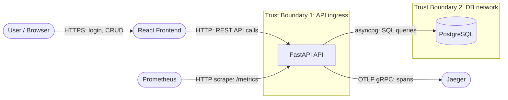

# Module 19 — Threat Modeling & Security Architecture

## Learning Objectives

- Explain the STRIDE threat model methodology and apply it to a REST API
- Draw a Data Flow Diagram (DFD) for the Task Manager and identify trust boundaries
- Generate and prioritise threats using STRIDE, CVSS scoring, and risk appetite
- Map identified threats to existing mitigations already present in the codebase
- Use Claude Code's `/threat-model` skill to generate a structured threat backlog
- Write Architecture Decision Records (ADRs) for at least two mitigations you implement
- Understand the difference between threat modeling at design time vs. after deployment

---

## Background

### What is threat modeling?

Threat modeling is a structured exercise to answer four questions about a system:

1. **What are we building?** (architecture diagram, data flows, trust boundaries)
2. **What can go wrong?** (enumerate threats using a methodology like STRIDE)
3. **What are we going to do about it?** (mitigate, accept, transfer, or avoid each threat)
4. **Did we do a good job?** (verify mitigations are implemented and tested)

Threat modeling is most effective at design time — but it is also valuable after deployment, when it reveals gaps that weren't apparent during development. That is what this module does.

### STRIDE

STRIDE is a mnemonic for six threat categories, developed at Microsoft:

| Letter | Threat | Violated property | Task Manager example |
|--------|--------|-------------------|---------------------|
| **S** — Spoofing | Impersonating another user or service | Authentication | Forging a JWT with `alg:none` |
| **T** — Tampering | Modifying data in transit or at rest | Integrity | Changing `task.status` via a direct DB write |
| **R** — Repudiation | Denying an action was taken | Non-repudiation | User claims they didn't delete a project |
| **I** — Information Disclosure | Exposing data to unauthorised parties | Confidentiality | Stack trace leaking internal paths via 500 response |
| **D** — Denial of Service | Making the service unavailable | Availability | Flooding `POST /auth/login` with requests |
| **E** — Elevation of Privilege | Gaining capabilities beyond what's authorised | Authorisation | Accessing another user's projects via IDOR |

### Trust boundaries

A trust boundary is a line in the system where data crosses from one security context to another. Threats tend to cluster at boundaries.

For the Task Manager:

```
[ Browser ]  ──HTTPS──►  [ API (FastAPI) ]  ──TCP──►  [ DB (PostgreSQL) ]
     │                          │
     │                     Trust boundary 1:
     │                     JWT verified; input validated
     │
  Trust boundary 0:
  User-supplied input (never trusted)
```

---

## Prerequisites

The application must be running and the pen test results from Module 12 must be available:

```bash
docker compose up -d
curl -sf http://localhost:8000/health && echo "API ready"
```

Review your pen test report from Module 12 (`docs/pen-test-report.md`) — the pen test has already surfaced some of the threats you will now systematically catalogue.

---

## Activities

### 1. Draw the Data Flow Diagram (DFD)

A Level-1 DFD shows the major processes, data stores, external entities, and data flows in the system.

Create `docs/threat-model.md` and add the DFD as a Mermaid diagram:

````markdown
# Threat Model — Task Manager

**Date:** [today]  
**Author:** [your name]  
**Scope:** Task Manager API (v0.1.0) — authentication, project/task management, data persistence  
**Methodology:** STRIDE  
**Status:** Draft

---

## 1. Data Flow Diagram (DFD Level 1)



### Trust boundaries

| Boundary | What crosses it | Verification at boundary |
|----------|----------------|--------------------------|
| TB0 (browser → frontend) | User input | Client-side validation (not trusted); HTTPS |
| TB1 (frontend → API) | JWT in Authorization header; JSON request bodies | JWT signature; Pydantic schema validation; body size limit |
| TB2 (API → DB) | SQL via SQLAlchemy ORM | Parameterised queries; no raw SQL; soft-delete filters |
````

Ask Claude Code:
> "Read `backend/app/main.py`, `backend/app/routers/`, and `backend/app/middleware/`. Generate a DFD Level-0 (context diagram) and Level-1 (process diagram) in Mermaid format showing all data flows including the observability path to Jaeger and Prometheus. Include trust boundaries."

---

### 2. Enumerate threats with STRIDE

For each process in the DFD, apply STRIDE systematically. Add a threat table to `docs/threat-model.md`:

```markdown
## 2. STRIDE Threat Register

| ID | Category | Threat | Target component | Likelihood | Impact | Risk | Status |
|----|----------|--------|-----------------|------------|--------|------|--------|
| T-01 | Spoofing | Attacker forges JWT with `alg:none` attack | `POST /auth/login`, `GET /projects` | High | Critical | **Critical** | Mitigated |
| T-02 | Spoofing | Attacker steals JWT from localStorage via XSS | React frontend | Medium | High | **High** | Partially mitigated |
| T-03 | Tampering | Attacker modifies task status by bypassing business logic | `PATCH /projects/{id}/tasks/{id}` | Low | High | **Medium** | Mitigated |
| T-04 | Tampering | Attacker injects SQL to bypass owner_id filter | Repository queries | Low | Critical | **High** | Mitigated |
| T-05 | Repudiation | User denies creating or deleting a project | Audit log | Medium | Medium | **Medium** | Mitigated |
| T-06 | Information Disclosure | Stack trace leaks internal paths via 500 errors | Global exception handler | Medium | Medium | **Medium** | Mitigated |
| T-07 | Information Disclosure | DB credentials leaked in API logs | Structured logging | Low | Critical | **High** | Mitigated |
| T-08 | Information Disclosure | CORS misconfiguration allows unauthorised origin to call API | CORS middleware | Medium | High | **High** | Mitigated |
| T-09 | Denial of Service | Credential stuffing exhausts login endpoint | `POST /auth/login` | High | High | **High** | Mitigated |
| T-10 | Denial of Service | Oversized request body causes memory exhaustion | API ingress | Medium | Medium | **Medium** | Mitigated |
| T-11 | Denial of Service | JTI revocation set grows unbounded until OOM | In-memory `_revoked_jtis` set | Low | Medium | **Low** | Accepted |
| T-12 | Elevation of Privilege | IDOR — User B reads User A's projects | `GET /projects/{id}` | High | High | **Critical** | Mitigated |
| T-13 | Elevation of Privilege | Expired or revoked token accepted after logout | JWT validation | Medium | High | **High** | Mitigated |
| T-14 | Elevation of Privilege | Rate-limit bucket cleared by API restart allows brute-force | Rate limiter | Low | High | **Medium** | Accepted |
| T-15 | Information Disclosure | `/metrics` endpoint exposes internal topology to attackers | `GET /metrics` | Medium | Low | **Low** | Accepted |
| T-16 | Denial of Service | Missing DB connection pool limits cause pool exhaustion under load | SQLAlchemy engine | Medium | High | **High** | Mitigated |
```

**Risk scoring:** Likelihood × Impact, using a 3×3 matrix (Low/Medium/High).

Ask Claude Code:
> "Look at `backend/app/services/auth_service.py` and `backend/app/routers/deps.py`. Walk through the JWT validation flow. For threat T-13 (expired/revoked token accepted after logout), what code paths could allow a revoked token to still return 200? Does `is_revoked(jti)` run before or after `decode_token()`? Would a timing window allow an attacker to exploit this?"

---

### 3. Verify mitigations are implemented

For each "Mitigated" threat, confirm the mitigation exists in the codebase. Use Claude Code to help:

Ask Claude Code:
> "For threats T-01 through T-04, trace each mitigation through the codebase. For T-01 (alg:none), show the exact line in `auth_service.py` that prevents it. For T-02 (XSS token theft), what does the CSP header contain and does it prevent inline script execution? For T-03 (status bypass), show the validation in `task_service.py`. For T-04 (SQL injection), show how SQLAlchemy parameterises queries."

Document your findings in `docs/threat-model.md`:

```markdown
## 3. Mitigation Verification

| Threat | Mitigation | Location | Test coverage |
|--------|-----------|----------|---------------|
| T-01 | `jwt.decode(..., algorithms=["HS256"])` — explicit algorithm list | `auth_service.py:get_token_payload()` | `test_auth_integration.py::TestProtectedEndpoints::test_alg_none_token_rejected` |
| T-02 | CSP: `default-src 'none'` blocks inline scripts | `middleware/security_headers.py` | `test_governance.py::test_all_security_headers_present` |
| T-03 | `apply_task_update()` validates transitions | `services/task_service.py` | `test_task_service.py::TestApplyTaskUpdate::test_invalid_status_transition_raises` |
| T-04 | All queries use SQLAlchemy ORM with bound parameters | `repositories/*.py` | Integration tests; no raw SQL paths |
| T-05 | `logger.info("audit", action=...)` on every write | `routers/projects.py`, `routers/tasks.py`, `routers/auth.py` | `test_governance.py::test_audit_log_*` (11 event types) |
| T-06 | Global exception handler returns generic 500 message | `main.py::unhandled_exception_handler` | `test_observability.py::test_unhandled_exception_handler_returns_safe_json` |
| T-09 | `RateLimitMiddleware` — sliding window deque per IP, max 10 req/60 s | `middleware/rate_limit.py` | `test_governance.py::test_rate_limit_blocks_after_threshold` |
| T-10 | `MaxBodySizeMiddleware` — 1 MiB limit | `middleware/body_limit.py` | `test_governance.py::test_oversized_body_returns_413` |
| T-12 | `owner_id` filter on all repository queries | `repositories/project_repository.py` | `test_projects_integration.py::test_idor_*` |
| T-13 | `is_revoked(jti)` in `current_user` dependency; `JWTError` catches expired/tampered tokens | `routers/deps.py` | `test_auth_endpoints.py::test_logout_revokes_token`; `test_auth_integration.py::test_expired_token_returns_401`; `test_auth_integration.py::test_token_missing_sub_claim_returns_401` |
```

---

### 4. Address the accepted risks

For threats with status **Accepted**, write a formal risk acceptance in `docs/threat-model.md`:

```markdown
## 4. Accepted Risks

### T-11 — JTI revocation set grows unbounded
**Risk level:** Low  
**Accepted by:** Engineering team  
**Rationale:** Tokens expire after 30 minutes. Revoked JTIs are only retained until the process restarts. For a single-instance lab environment, the set is bounded by the lifetime of the process and the number of logout operations — neither is large. In production, this is replaced by a Redis-backed revocation set with automatic TTL expiry.  
**Monitoring:** None required for lab; Redis migration tracked in `docs/adr/0004-security-controls.md`.

### T-14 — Rate-limit bucket cleared by API restart
**Risk level:** Medium  
**Accepted by:** Engineering team  
**Rationale:** An attacker would need to trigger an API restart (e.g., via an OOM condition) to reset the bucket. This is a low-probability scenario. Production mitigation is Redis-backed rate limiting. The current implementation satisfies the OWASP A04 pen test requirement.  
**Monitoring:** `HighRejectionRate` alert detects elevated attack traffic; `runbook-high-rejection-rate.md` addresses response.

### T-15 — /metrics exposes internal topology
**Risk level:** Low  
**Accepted by:** Engineering team  
**Rationale:** The `/metrics` endpoint reveals service version, metric names, and cardinality information. In the lab, this is acceptable. In production, restrict access to `/metrics` to the Prometheus scraper's IP range via network policy or a reverse proxy (`location /metrics { allow 10.0.0.0/8; deny all; }`).  
**Monitoring:** Not monitored in lab environment.
```

Ask Claude Code:
> "Review the accepted risks T-11, T-14, and T-15. For each one, propose a specific production mitigation and estimate the implementation effort (small/medium/large). Which would you prioritise first if this were moving to production next month?"

---

### 5. Use the `/threat-model` skill

The project includes a `/threat-model` Claude Code skill that generates a structured threat backlog for a specific feature or component. Use it:

```
/threat-model authentication
```

Compare the output with the threats you identified manually:
- Did it catch anything you missed?
- Did you identify anything it missed?
- Did it correctly identify the mitigations already in place?

Ask Claude Code:
> "I ran `/threat-model authentication` and got [paste output]. Compare these findings with `docs/threat-model.md`. Which threats appear in one document but not the other? What does the delta tell us about the limitations of AI-assisted threat modeling vs. manual STRIDE analysis?"

---

### 6. Write an ADR for one unmitigated threat

Choose one threat that is currently **Accepted** or **Partially mitigated** and write an ADR proposing a concrete mitigation.

Example: ADR for T-02 (XSS token theft — tokens in localStorage):

Create `docs/adr/0008-token-storage-strategy.md`:

```markdown
# ADR 0008 — JWT Storage Strategy: localStorage vs. httpOnly Cookie

**Date:** [today]
**Status:** Proposed

## Context

JWT access tokens are currently stored in browser localStorage (see `frontend/src/App.tsx`).
`localStorage` is accessible to any JavaScript running on the page. If an attacker exploits an XSS
vulnerability in the React frontend, they can steal the token and use it to impersonate the user.

The CSP header (`default-src 'none'`) significantly reduces XSS risk by blocking inline scripts.
However, a compromised npm package in the build could still execute as first-party JavaScript and
access localStorage.

## Options

### Option A — Keep localStorage (current)
Simple. Works with the current stateless JWT architecture. Mitigated (but not eliminated) by CSP.

### Option B — httpOnly cookie with CSRF token
Tokens stored in httpOnly cookies are not accessible to JavaScript. However:
- The API must set the cookie on login and clear it on logout
- Every state-changing request must include a CSRF token to prevent CSRF attacks
- CORS policy must be updated to allow credentials

### Option C — In-memory storage (React state + refresh token in httpOnly cookie)
Access token lives only in React state (lost on page refresh). A refresh token in an httpOnly
cookie is used to obtain a new access token silently. This is the gold standard for SPAs.
Requires a `/auth/refresh` endpoint.

## Decision

**Keep localStorage for the lab (Option A).** The CSP header blocks the primary XSS attack vector.
Moving to Option B or C would require significant changes to both the API and the React app, which
is out of scope for this learning exercise.

**For production:** Option C (in-memory + httpOnly refresh token) is recommended. This decision
is deferred until the application moves out of lab context.

## Consequences

- The XSS risk is partially mitigated via CSP, not eliminated
- This limitation is documented in `docs/threat-model.md` as T-02 (Partially mitigated)
- Any third-party npm package added to the frontend must be carefully vetted — it could steal tokens
```

Ask Claude Code:
> "Review ADR 0008. Is the decision to keep localStorage reasonable given the CSP mitigation? What would the implementation of Option B (httpOnly cookie + CSRF) look like in FastAPI? Show the key code changes needed in `backend/app/routers/auth.py` and the relevant React changes."

---

## Checkpoint

- [ ] `docs/threat-model.md` created with DFD, STRIDE threat register (≥ 12 threats), and mitigation verification table
- [ ] Each existing mitigation traced to a specific file and line in the codebase
- [ ] Accepted risks documented with rationale and monitoring approach
- [ ] `/threat-model authentication` skill used; output compared to manual analysis
- [ ] `docs/adr/0008-token-storage-strategy.md` (or equivalent) written for one accepted/partial risk
- [ ] Commit: `docs(security): add threat model with STRIDE analysis, mitigation verification, and token storage ADR`

> **Reference implementation:** `docs/threat-model.md` contains a 23-threat STRIDE register covering the full three-tier stack, with DFD, per-threat mitigation status, residual risk register, and controls summary. Use it as a benchmark, not a starting point — build yours independently first.

---

## Troubleshooting

| Problem | Likely cause | Fix |
|---------|-------------|-----|
| Mermaid diagram not rendering in GitHub | GitHub MD renderer lag | View in VS Code with Mermaid extension, or use https://mermaid.live |
| `/threat-model` skill not available | Skill file not in `.claude/commands/` | Verify `ls .claude/commands/threat-model.md` exists |
| Can't trace mitigation to specific file | Unfamiliar with codebase | Ask Claude Code: "Which file and function implements JWT algorithm pinning?" |
| STRIDE feels arbitrary | Threat enumeration takes practice | Start from data flows: for each arrow in the DFD, ask "what could an attacker do to this data flow?" |
| Risk register has too many rows | All systems have many threats | Prioritise: focus on Critical and High risks first; accept Low risks with documentation |

---

## Going Further

- **PASTA (Process for Attack Simulation and Threat Analysis):** A more comprehensive seven-stage process that includes attacker profiling and business impact analysis. More rigorous than STRIDE for regulated industries.
- **Attack trees:** Visual representations of how an attacker achieves a goal, exploring multiple attack paths. Complement STRIDE by showing attack composition.
- **MITRE ATT&CK:** A knowledge base of adversary tactics, techniques, and procedures (TTPs). Use it to cross-reference your STRIDE threats against real-world attack patterns.
- **Scheduled threat model reviews:** Threat models go stale as the system evolves. Schedule a quarterly review tied to your ADR review cycle. Any new feature should trigger a threat model update.
- **Threat modeling in CI:** Tools like [ThreatSpec](https://github.com/threatspec/threatspec) can annotate code with threat model data and generate reports as part of CI. This keeps the threat model in sync with the codebase.
