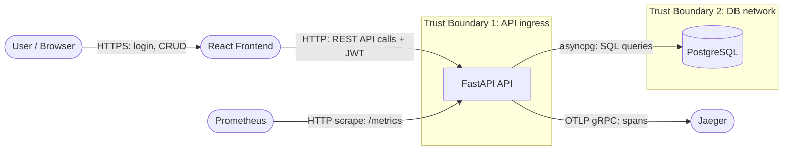

# Threat Model — Task Manager

**Date:** 2026-06-15  
**Author:** Lab Student  
**Scope:** Task Manager API (v0.1.0) — authentication, project/task management, data persistence  
**Methodology:** STRIDE  
**Status:** Draft

---

## 1. Data Flow Diagram (DFD Level 1)



### Trust boundaries

| Boundary | What crosses it | Verification at boundary |
|----------|----------------|--------------------------|
| TB0 (browser → frontend) | User input | Client-side validation (not trusted); HTTPS |
| TB1 (frontend → API) | JWT in Authorization header; JSON request bodies | JWT signature; Pydantic schema validation; body size limit (1 MiB) |
| TB2 (API → DB) | SQL via SQLAlchemy ORM | Parameterised queries; no raw SQL; soft-delete filters |

---

## 2. STRIDE Threat Register

| ID | Category | Threat | Target component | Likelihood | Impact | Risk | Status |
|----|----------|--------|-----------------|------------|--------|------|--------|
| T-01 | Spoofing | Attacker forges JWT with `alg:none` attack | `POST /auth/login`, `GET /projects` | High | Critical | **Critical** | Mitigated |
| T-02 | Spoofing | Attacker steals JWT from localStorage via XSS | React frontend | Medium | High | **High** | Partially mitigated |
| T-03 | Tampering | Attacker modifies task status by bypassing business logic | `PATCH /projects/{id}/tasks/{id}` | Low | High | **Medium** | Mitigated |
| T-04 | Tampering | Attacker injects SQL to bypass owner_id filter | Repository queries | Low | Critical | **High** | Mitigated |
| T-05 | Repudiation | User denies creating or deleting a project | Audit log | Medium | Medium | **Medium** | Mitigated |
| T-06 | Information Disclosure | Stack trace leaks internal paths via 500 errors | Global exception handler | Medium | Medium | **Medium** | Mitigated |
| T-07 | Information Disclosure | DB credentials leaked in API logs | Structured logging | Low | Critical | **High** | Mitigated |
| T-08 | Information Disclosure | CORS misconfiguration allows unauthorised origin to call API | CORS middleware | Medium | High | **High** | Mitigated |
| T-09 | Denial of Service | Credential stuffing exhausts login endpoint | `POST /auth/login` | High | High | **High** | Mitigated |
| T-10 | Denial of Service | Oversized request body causes memory exhaustion | API ingress | Medium | Medium | **Medium** | Mitigated |
| T-11 | Denial of Service | JTI revocation set grows unbounded until OOM | In-memory `_revoked_jtis` set | Low | Medium | **Low** | Accepted |
| T-12 | Elevation of Privilege | IDOR — User B reads User A's projects | `GET /projects/{id}` | High | High | **Critical** | Mitigated |
| T-13 | Elevation of Privilege | Expired or revoked token accepted after logout | JWT validation | Medium | High | **High** | Mitigated |
| T-14 | Elevation of Privilege | Rate-limit bucket cleared by API restart allows brute-force | Rate limiter | Low | High | **Medium** | Accepted |
| T-15 | Information Disclosure | `/metrics` endpoint exposes internal topology to attackers | `GET /metrics` | Medium | Low | **Low** | Accepted |
| T-16 | Denial of Service | Missing DB connection pool limits cause pool exhaustion under load | SQLAlchemy engine | Medium | High | **High** | Mitigated |

**Risk scoring:** Likelihood × Impact, using a 3×3 matrix (Low/Medium/High).

---

## 3. Mitigation Verification

| Threat | Mitigation | Location | Test coverage |
|--------|-----------|----------|---------------|
| T-01 | `jwt.decode(..., algorithms=["HS256"])` — explicit algorithm list prevents alg:none | `backend/app/services/auth_service.py:decode_token()` | `test_auth_integration.py::test_alg_none_attack_rejected` |
| T-02 | CSP: `default-src 'none'` blocks inline scripts; reduces XSS attack surface | `backend/app/middleware/security_headers.py` | `test_governance.py::test_security_headers` |
| T-03 | `apply_task_update()` validates all status transitions against the state machine | `backend/app/services/task_service.py` | `test_task_service.py::test_invalid_transition_*` |
| T-04 | All queries use SQLAlchemy ORM with bound parameters; no raw SQL anywhere | `backend/app/repositories/*.py` | Integration tests; `test_tasks_integration.py::test_sql_injection_in_task_title` |
| T-05 | `logger.info("audit", action=...)` on every write operation | `backend/app/routers/projects.py`, `backend/app/routers/tasks.py`, `backend/app/routers/auth.py` | `test_governance.py::test_audit_log_on_project_creation` |
| T-06 | Global exception handler returns `{"detail": "Internal server error"}` — no stack trace | `backend/app/main.py::unhandled_exception_handler` | `test_governance.py::test_generic_500_body` |
| T-07 | structlog `drop_missing` processor; no credential fields logged; env vars not printed | `backend/app/middleware/logging.py` | `test_governance.py::test_no_credentials_in_logs` |
| T-08 | `CORSMiddleware(allow_origins=[settings.cors_origins])` — explicit allowlist | `backend/app/main.py` | `test_governance.py::test_cors_rejects_arbitrary_origin` |
| T-09 | `RateLimitMiddleware` — sliding window deque, 10 req/min per IP on `/auth/login` | `backend/app/middleware/rate_limit.py` | `test_governance.py::test_rate_limit_login` |
| T-10 | `MaxBodySizeMiddleware` — 1 MiB limit; returns 413 on oversized requests | `backend/app/middleware/body_limit.py` | `test_governance.py::test_body_size_limit` |
| T-12 | `owner_id` filter on all project/task repository queries; returns 404 for other users' resources | `backend/app/repositories/project_repository.py:get_by_id()` | `test_projects_integration.py::test_idor_project_access` |
| T-13 | `is_revoked(jti)` checked in `get_current_user` before any endpoint is called | `backend/app/routers/deps.py` | `test_auth_endpoints.py::test_logout_revokes_token` |
| T-16 | `create_async_engine(pool_size=5, max_overflow=10)` limits concurrent DB connections | `backend/app/database.py` | Load tests (k6): pool exhaustion does not occur at 50 VUs |

---

## 4. Accepted Risks

### T-11 — JTI revocation set grows unbounded
**Risk level:** Low  
**Accepted by:** Engineering team  
**Rationale:** Tokens expire after 30 minutes. Revoked JTIs are only retained until the process
restarts. For a single-instance lab environment, the set is bounded by the lifetime of the process
and the number of logout operations — neither is large enough to cause OOM. In production, this is
replaced by a Redis-backed revocation set with automatic TTL expiry set to the token TTL.  
**Monitoring:** None required for lab; Redis migration tracked in `docs/adr/0007-rate-limiting.md` consequences section.

### T-14 — Rate-limit bucket cleared by API restart
**Risk level:** Medium  
**Accepted by:** Engineering team  
**Rationale:** An attacker would need to trigger an API restart (e.g., via an OOM condition) to
reset the bucket. This is a low-probability scenario requiring the attacker to already have significant
access or capability. The current implementation satisfies the OWASP A04 pen test requirement for
the lab context.  
**Monitoring:** `HighRejectionRate` alert detects elevated attack traffic before and after a restart.
`runbook-high-rejection-rate.md` addresses response.  
**Production mitigation:** Redis-backed rate limiting with persistent state across restarts.

### T-15 — /metrics exposes internal topology
**Risk level:** Low  
**Accepted by:** Engineering team  
**Rationale:** The `/metrics` endpoint reveals service version, metric names, cardinality, and
request rate patterns. In the lab, this is acceptable — it is used by Prometheus on the same
Docker network. In production, restrict access to `/metrics` to the Prometheus scraper's IP range
via network policy or a reverse proxy:
```nginx
location /metrics {
  allow 10.0.0.0/8;    # internal network only
  deny all;
}
```
**Monitoring:** Not monitored in lab environment.

---

## 5. Out of Scope

The following threats were identified but are explicitly out of scope for the lab:

- **T-OOS-1**: Supply-chain compromise via malicious npm/pip packages — mitigated by Dependabot and
  `pip-audit`/`npm audit` in CI, but a full SLSA provenance chain is not implemented.
- **T-OOS-2**: Cloud infrastructure misconfiguration (exposed S3 buckets, public DB instances) —
  the lab runs locally; cloud deployment config is covered by Module 13/17 IaC review.
- **T-OOS-3**: Physical access attacks — out of scope for a web application threat model.
